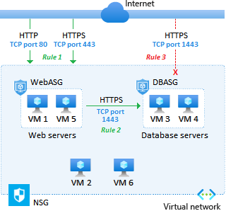

# Networking in Azure

- Cloudflare: 
  + dash.cloudflare.com
  + https://www.cloudflare.com/learning/

- https://learn.microsoft.com/en-us/azure/architecture/networking/
- Azure Architecture: https://learn.microsoft.com/en-us/azure/architecture/

- OSI: https://www.cloudflare.com/learning/ddos/glossary/open-systems-interconnection-model-osi/

- Azure Virtual Network, Subnet
- Azure NAT (Network Address Translation) Gateway:
  + is a fully managed and highly resilient Network Address Translation (NAT) service.
  + You can use Azure NAT Gateway to let all instances in a private subnet connect outbound to the internet while remaining fully private.
- NIC (Network Interface Card)
- NSG (Network security group)
- ASG (Application security group)

- Azure VPN Gateway:
  + is a service that can be used to send encrypted traffic between an Azure virtual network and on-premises locations over the public Internet.

- ExpressRoute
  + lets you extend your on-premises networks into the Microsoft cloud over a private connection with the help of a connectivity provider. 
  + With ExpressRoute, you can establish connections to Microsoft cloud services, such as Microsoft Azure and Microsoft 365.

## Networking Concepts
1. Concepts
    - Open Systems Interconnection (OSI) Model
    - IP (Internet Protocol)
    - MAC address
    - LAN (local area network)
    - Network switch
    - IP address
    - static IP address vs dynamic
    - my IP address
    - IPv4 / IPv6
    - LANs / WANs (local area networks, wide area networks)
    - ISP (Internet Service Provider)
    - VPNs (Virtual private networks)
    - TLS (Transport Layer Security)
    - SSL (Secure Sockets Layer)
    - ICMP (Internet Control Message Protocol)

1. Network layer

    1. Network layer
        - What is the network layer? | Network vs. Internet layer
          + The network layer is layer 3 in the OSI model, and it is responsible for connections between different networks.

        1. What is the network layer?
            - Network-to-network connections are what make the Internet possible. 
              + The "network layer" is the part of the Internet communications process where these connections occur, by sending packets of data back and forth between different networks.


        2. What is a network?
            - A network is a group of two or more connected computing devices.
            - Usually all devices in the network are connected to a central hub — for instance, a **router**. 

        3. What happens at the network layer?
            - Anything that has to do with inter-network connections takes place at the network layer. 
            - This includes setting up the routes for data packets to take, checking to see if a server in another network is up and running, and addressing and receiving IP packets from other networks. 
            - This last process is perhaps the most important, as the vast majority of Internet traffic is sent over IP.

        4. What is a packet?
            - All data sent over the Internet is broken down into smaller chunks called "packets." 

        5. What is the OSI model?
            - The Open Systems Interconnection (OSI) Model is a description of how the Internet works.
            - https://www.cloudflare.com/learning/ddos/glossary/open-systems-interconnection-model-osi/
            
            - 7 layers:
              + 7- Application Layer
                - Data generated by and usable by software applications.
                - main protocol: Http
              + 6- Presentation Layer
                - Data is translated into a form the application can accept.
                - Main protocol: HTTPS encryption and decryption

              + 5- Session Layer
                - Controls connections between computers (this can also be handled at layer 4 by the TCP protocol).

              + 4- Transport Layer
                - Provides the means for transmitting data between the two connected parties, as well as controlling the quality of service.
                - Main protoco: TCP (Transmission Control Protocol), UDP (user datagram protocol)

              + 3- Network Layer
                - Handles the routing and sending of data between different networks. 
                - Most important protocol: IP (Internet Protocol), ICMP (Internet Control Message Protocol)

              + 2- Data link layer
                - Handles communications between devices on the same network.
                - Most used protocol: Ethernet 

              + 1- Physical Layer
                - Packets are converted into electrical, radio, or optical pulses and transmitted as bits (the smallest possible units of information) over wires, radio waves, or cables.

        6. OSI model vs. TCP/IP model
            - The TCP/IP model is an alternative model of how the Internet works.
              + It divides the processes involved into four layers instead of seven.
                - 4. Application layer: layer 7 in the OSI model.
                  + HTTPS encryption and decryption
                  + protocol: Http, Https

                - 3. Transport layer: layer 4 in the OSI model.
                  + include session layer
                  + protocol: TCP, UDP

                - 2. Internet layer: layer 3 in the OSI model.
                  + protocol: IP, ICMP

                - 1. Network access layer: Combines the processes of layers 1 and 2 in the OSI model.

        7. What is the difference between the 'network' layer and the 'Internet' layer?

        8. What protocols are used at the network layer?
            - A protocol is an agreed-upon way of formatting data so that two or more devices are able to communicate with and understand each other. 
            - IP, IPsec, ICMP, IGMP, GRE

    2. How Internet works
        1. What is the Internet?
            - The Internet is a vast, sprawling collection of networks that connect to each other.
            - Internet: interconnected networks

        2. What is distributed networking, and why is this concept important for the Internet?
            - There is no control center for the Internet.
            - Any computer or hardware that can send and receive data in the correct fashion (e.g. using the correct networking protocols) can be part of the Internet.

        3. How does the Internet work?
            - two main concepts of the Internet functions: **packets** and **protocols**
            - 1. Packets
              + In networking, a packet is a small segment of a larger message. 
              + Each packet contains both data and information about that data.
                - header
              + Packets are sent across the Internet using a technique called packet switching.
                - Intermediary routers and switches are able to process packets independently from each other, without accounting for their source or destination.
                - This is by design so that no single connection dominates the network.
              + Packets traveled over wires, cables, and radio waves.

            - 2. Protocols
              + In networking, a protocol is a standardized way of doing certain actions and formatting data so that two or more devices are able to communicate with and understand each other.

              + There are protocols 
                - for sending packets between devices on the same network (**Ethernet**), 
                - for sending packets from network to network (**IP**), 
                - for ensuring those packets successfully arrive in order (**TCP**), and 
                - for formatting data for websites and applications (*HTTP*). 
              + In addition to these foundational protocols, there are also protocols for routing, testing, and encryption.
              + And there are alternatives to the protocols listed above for different types of content — for instance, streaming video often uses **UDP** instead of **TCP**.

        4. What physical infrastructure makes the Internet work?
            - Some of the most important types:
              + **Routers**: forward packets to different computer networks based on their destination.
                - for Internet, Network to Network.
              + **Switches**: connect devices that share a single network.
                - for LANs, a Network.
                - They use packet switching to forward packets to the correct devices. 
                - They also receive outbound packets from those devices and pass them along to the right destination.

              + **Web servers** are specialized high-powered computers that store and serve content (webpages, images, videos) to users, in addition to hosting applications and databases.
                - Servers also respond to DNS queries and perform other important tasks to keep the Internet up and running.
                - Most servers are kept in large data centers, which are located throughout the world.

        5. How do these concepts relate to websites and applications users access over the Internet?
            - In order for you to see it, it was sent over the Internet piece by piece in the form of several thousand data packets. 
              + These packets traveled over cables and radio waves and through routers and switches from our web server to your computer or device. 
              + Your computer or smartphone received those packets and passed them to your device's browser, and your browser interpreted the data within the packets in order to display the text you are reading now.

            - The specific steps involved in this process are:
              + 1. DNS query
                - When your browser started to load this webpage, it likely first made a DNS query to find out the Cloudflare website's IP address.

              + 2. TCP handshake
                - Your browser opened a connection with that IP address.

              + 3. TLS handshake
                - Your browser also set up encryption between a Cloudflare web server and your device so that attackers cannot read the data packets that travel between those two endpoints.

              + 4. HTTP request
                - Your browser requested the content that appears on this webpage.

              + 5. HTTP response
                - Cloudflare's server transmitted the content in the form of HTML, CSS, and JavaScript code, broken up into a series of data packets. 
                  + Once your device received the packets and verified it had received all of them, your browser interpreted the HTML, CSS, and JavaScript code contained in the packets to render this article about how the Internet works. 
                  + The whole process took only a second or two.

    3. Networking basics
        1. What is routing?
            - On the Internet, routing is the way IP packets of data travel from their origin to their destination.

        2. What is a router?
            - A router is a device that connects two or more IP networks or subnetworks.

            - is a device that connects two or more packet-switched networks or subnetworks.
              + A LAN usually requires a single router.
              + a WAN is distributed over a large area, it often necessitates multiple routers and switches.
              + a router uses an internal routing table — a list of paths to various network destinations.

            - router vs modem:
              + A router forms networks and manages the flow of data within and between those networks, while a modem connects those networks to the Internet.
                - Modems forge a connection to the Internet by converting signals from an ISP into a digital signal that can be interpreted by any connected device.
              + router: forms networks and manages the flow of data within and between those networks
                - create a LAN and send data between the devices on that network, but not be able to connect that network to the Internet.
              + modem: connects those networks to the Internet.
                - A single device may plug into a modem in order to connect to the Internet.

            - types of routers: Wireless router & Wired router
            - specialized types of routers that serve specific functions:
              + Core router
              + Edge router
              + Virtual router

        3. Network switch
            - A network switch forwards data packets between devices. 
              + Switches send packets directly to devices, rather than sending them to networks like a router does.

        4. What is the packet
            - Any data sent over the Internet is divided into smaller segments called packets.

        5. What is the protocol?
            - In networking, a protocol is a standardized set of rules for formatting and processing data. 
              + Protocols enable computers to communicate with one another.

        6. What is tunnelling?
            - Tunneling is a way to move packets from one network to another.
              + Tunneling works via encapsulation: wrapping a packet inside another packet.

            - In networking, tunnels are a method for transporting data across a network using protocols that are not supported by that network.-
              + Tunneling works by encapsulating packets: wrapping packets inside of other packets. 
              + Tunneling is often used in virtual private networks (VPNs).

            1. How does packet encapsulation work?
                - A typical packet has two parts: 
                  + header: indicates the packet's destination and the protocol it uses
                  + payload: the packet's actual contents.

            2. Why is encapsulation useful?
                - Imagine a company wants to set up a wide area network (WAN) connecting Office A and Office B. 
                  + The company uses the IPv6 protocol but there is a network between Office A and Office B that only supports IPv4. 
                  + By encapsulating their IPv6 packets inside IPv4 packets, the company can continue to use IPv6 while still sending data directly between the offices.

                - Encapsulation is also useful for encrypted network connections.
                  + By wrapping the encrypted packet inside another unencrypted packet, the packet can travel across networks like normal.

            3. What is a VPN tunnel?
                - A VPN is a secure, encrypted connection over a publicly shared network.

                - Many VPNs use the **IPsec** protocol suite. 
                  + **IPsec** is a group of protocols that run directly on top of IP at the network layer. 

                - Another protocol in common use for VPNs is **Transport Layer Security** (**TLS**). 
                  + **TLS** protocol operates at either layer 6 or layer 7 of the OSI model depending on how the model is interpreted.
                  + **TLS** is sometimes called **SSL** (Secure Sockets Layer), although SSL refers to an older protocol that is no longer in use.

            4. What is split tunneling?
                - split tunneling lets user devices connect to two networks simultaneously: one public and one private.

            5. What is GRE tunneling?
                - Generic Routing Encapsulation (**GRE**) is one of several tunneling protocols.
                - GRE encapsulates data packets that use one routing protocol inside the packets of another protocol.
                - GRE is one way to set up a direct point-to-point connection across a network, for the purpose of simplifying connections between separate networks.

            6. What is IP-in-IP?
                - IP-in-IP is a tunneling protocol for encapsulating IP packets inside other IP packets.
                - IP-in-IP does not encrypt packets and is not used for VPNs.

            7. What is SSH tunneling?
                - The Secure Shell (SSH) protocol sets up encrypted connections between client and server, and can also be used to set up a secure tunnel. 
                - SSH operates at layer 7 of the OSI model, the application layer. 
                - By contrast, **IPsec**, **IP-in-IP**, and **GRE** operate at the network layer.

            8. What are some other tunneling protocols?
                - In addition to GRE, IPsec, IP-in-IP, and SSH, other tunneling protocols:
                  + Point-to-Point Tunneling Protocol (PPTP)
                  + Secure Socket Tunneling Protocol (SSTP)
                  + Layer 2 Tunneling Protocol (L2TP)
                  + Virtual Extensible Local Area Network (VXLAN)

        7. What is a port?
            - Ports are virtual places within an operating system where network connections start and end.
              + They help computers sort the network traffic they receive.

            - A port is a virtual point where network connections start and end. 
              + Ports are software-based and managed by a computer's operating system. 
              + Each port is associated with a specific process or service. 
              + Ports allow computers to easily differentiate between different kinds of traffic: emails go to a different port than webpages, for instance, even though both reach a computer over the same Internet connection.

            1. What is a port number?
                - Ports are standardized across all network-connected devices, with each port assigned a number.
                  + Most ports are reserved for certain **protocols** — for example, all **Hypertext Transfer Protocol (HTTP)** messages go to port 80.

                - While IP addresses enable messages to go to and from specific devices, port numbers allow targeting of specific services or applications within those devices.

            2. How do ports make network connections more efficient?
                - The use of ports helps computers understand what to do with the data they receive.

                - Suppose Bob transfers an MP3 audio recording to Alice using the File Transfer Protocol (FTP).
                  + If Alice's computer passed the MP3 file data to Alice's email application, the email application would not know how to interpret it. 
                  + But because Bob's file transfer uses the port designated for **FTP (port 21)**, Alice's computer is able to receive and store the file.

                - Meanwhile, Alice's computer can simultaneously load HTTP webpages using port 80, even though both the webpage files and the MP3 sound file flow to Alice's computer over the same WiFi connection.

            3. Are ports part of the network layer?
                - Ports are a transport layer (layer 4) concept. 
                  + Only a transport protocol such as the **Transmission Control Protocol (TCP)** or **User Datagram Protocol (UDP)** can indicate which port a packet should go to. 
                  + TCP and UDP headers have a section for indicating port numbers. 
                  + **Network layer** protocols — for instance, the **Internet Protocol (IP)** — are unaware of what port is in use in a given network connection.

                - ICMP (Internet Control Message Protocol) is a network layer protocol that can ping networked devices — but without the ability to ping specific ports, network administrators cannot test specific services within those devices.

            4. Why do firewalls sometimes block specific ports?
                - A firewall is a **network security system** that blocks or allows network traffic based on a set of security rules.
                  + Firewalls usually sit between a trusted network and an untrusted network; often the untrusted network is the Internet. 
                  + For example, office networks often use a firewall to protect their network from online threats.

                - Properly configured firewalls block traffic to all ports by default except for a few predetermined ports known to be in common use.
                  + For instance, a corporate firewall could only leave open ports 25 (email), 80 (web traffic), 443 (web traffic), and a few others, allowing internal employees to use these essential services, then block the rest of the **65,000+** ports.

            5. What are the different port numbers?
                - There are **65,535** possible port numbers, although not all are in common use. 
                - Some of the most commonly used ports, along with their associated networking protocol, are:
                  + 1. **Ports 20 and 21**: File Transfer Protocol (FTP). 
                    - FTP is for transferring files between a client and a server.
                  + 2. Port 22: Secure Shell (SSH). 
                    - SSH is one of many tunneling protocols that create secure network connections.

                  + 3. Port 25: Historically, Simple Mail Transfer Protocol (SMTP). SMTP is used for email.
                  + 4. Port 53: Domain Name System (DNS)
                    - DNS is an essential process for the modern Internet; it matches human-readable domain names to machine-readable IP addresses.
                  + 5. Port 80: Hypertext Transfer Protocol (HTTP).
                    - HTTP is the protocol that makes the World Wide Web possible.

                  + 6. Port 123: **Network Time Protocol** (NTP). 
                    - NTP allows computer clocks to sync with each other, a process that is essential for encryption.

                  + 7. Port 179: Border Gateway Protocol (BGP). 
                    - BGP is essential for establishing efficient routes between the large networks that make up the Internet (these large networks are called autonomous systems). 
                    - Autonomous systems use BGP to broadcast which IP addresses they control.

                  + 8. Port 443: HTTP Secure (HTTPS). 
                    - HTTPS is the secure and encrypted version of HTTP. 
                    - All HTTPS web traffic goes to port 443. 
                    - Network services that use HTTPS for encryption, such as DNS over HTTPS, also connect at this port.

                  + 9. Port 500: Internet Security Association and Key Management Protocol (ISAKMP), which is part of the process of setting up secure **IPsec** connections.

                  + 10. Port 587: Modern, secure SMTP that uses encryption.

                  + 11. Port 3389: Remote Desktop Protocol (RDP).
                    - RDP enables users to remotely connect to their desktop computers from another device.

                - The **Internet Assigned Numbers Authority** (IANA) maintains the **full list** of port numbers and protocols assigned to them.
                  + https://www.iana.org/assignments/service-names-port-numbers/service-names-port-numbers.xhtml

                - Port numbers are assigned in three ranges: 
                  + System Ports (0-1023)
                  + User Ports (1024-49151)
                  + Dynamic and/or Private Ports (49152-65535)

        8. What is the Control plane? Control plane vs. data plane
            - The control plane is the part of a network that controls how data is forwarded, while the data plane is the actual forwarding process.

            1. What is the control plane?
                - The control plane is the part of a network that controls how data packets are forwarded — meaning how data is sent from one place to another. 
                  + The process of creating a routing table, for example, is considered part of the control plane.
                  + Routers use various protocols to identify network paths, and they store these paths in **routing tables**.

            2. What protocols do routers use to create their routing tables?
                - **Border Gateway Protocol (BGP)**: https://www.cloudflare.com/learning/security/glossary/what-is-bgp/
                - Open Shortest Path First (OSPF)
                - Enhanced Interior Gateway Routing Protocol (EIGRP)
                - Intermediate System to Intermediate System (IS-IS)

    4. Network types
        1. What is a LAN (local area network)?
            - A LAN, or local area network, is a group of connected computing devices within a localized area that usually share a centralized Internet connection.

        2. What is a WAN? | WAN vs. LAN
            - A wide area network (WAN) is any network that extends over a large geographic area, usually connecting multiple local area networks (LANs).

        3. What is an SD-WAN?
            - A software-defined wide area network (SD-WAN) connects local area networks (LANs) across large distances using controlling software that works with a variety of networking hardware.

        4. What is a metropolitan area network (MAN)?
            - A metropolitan area network (MAN) is smaller than a wide area network (WAN) but larger than a local area network (LAN).

        5. What is a campus area network (CAN)?
            - Most often used on college and university campuses, a campus area network (CAN) is a computer network that connects multiple buildings within a large property.

        6. What is a personal area network (PAN)?
            - A personal area network (PAN) connects electronic devices close to the user, such as a wireless mouse, a keyboard, and a computer.

        7. What is an autonomous system? | What are ASNs?
            - An autonomous system (AS) is a very large network or group of networks with a single routing policy. Each AS is assigned a unique ASN, which is a number that identifies the AS.

        8. What is NaaS (network-as-a-service)?
            - Network-as-a-service (NaaS) is a cloud service model in which customers rent networking services from a cloud vendor instead of setting up their own network infrastructure.

        9. What is enterprise networking?
            - An enterprise network privately connects branch offices, internal data centers, and employee devices. Today, enterprise networking is rapidly evolving.

    5. Protocols
        1. Internet Protocol (IP)
            - The Internet Protocol (IP) is a set of requirements for addressing and routing data on the Internet.
              + IP can be used with several transport protocols, including TCP and UDP.

            1. What is the Internet Protocol (IP)?
            2. What is a network protocol?
            3. What is an IP address? How does IP addressing work?
            4. IPv4 vs. IPv6
            5. What is an IP packet?
                - Header length
                - Packet length
                - Time to live (TTL)
                - Which transport protocol is being used (TCP, UDP, etc.)
            6. How does IP routing work?
            7. What is TCP/IP?
            8. What is UDP/IP?
            9. Do network switches refer to IP addresses?
                - MAC address

        2. What is IPsec? | How IPsec VPNs work
            - IPsec is a group of networking protocols used for setting up secure encrypted connections, such as VPNs, across publicly shared networks.

        3. What is IGMP? | Internet Group Management Protocol
            - The Internet Group Management Protocol (IGMP) enables a group of networked devices to share the same IP address and receive the same messages.

        4. What is IGMP snooping?
            - The Internet Group Management Protocol (IGMP) is used to set up multicasting groups.
              + IGMP snooping allows network switches to be aware of these groups and forward network traffic accordingly.

        5. What is MPLS (multiprotocol label switching)?
            - Multiprotocol label switching (MPLS) is a method for setting up dedicated paths across networks without relying on the typical routing process.

        6. What is GRE tunneling? | How GRE protocol works
            - Generic Routing Encapsulation, or GRE, is a protocol for wrapping data packets inside secondary data packets in order to set up a direct point-to-point network connection.

    6. Glossary
        1. How to secure a website
            1. What is website security?
                - Website security is the practice, methods, and protocol aimed at protecting and securing a website and its data.
                - The methods are designed to prevent a wide range of cyber security threats, such as DDoS attacks, SQL injection attacks or malware. 
                - Cyber security threats can have wide and devastating impact for businesses, such as economic costs, such as loss in revenue and expenses for remediation, damaged brand reputation from poor media coverage and loss of trust, and regulatory costs such as significant fines for failing to protect PII data in accordance with GDPR or HIPAA.

            2. Why is website security important?
                - Implementing website security measures are critical to protecting businesses from cyber attacks. 
                - Blocking potential threats help organizations:
                  + Protect sensitive data
                  + Avoid business disruption
                  + Comply with regulatory requirements
                    - Most businesses are accountable to a variety of federal and international regulations, including HIPAA, Payment Card Industry, and GDPR. Non-compliance will result in heavy fines and penalties.
                  + Improve SEO and website visibility
                    - Search engines such as Google or Bing penalize businesses for infected or unsecured websites.


            3. How to secure a website?
                - There are many ways to secure a website.
                - Many of the best practices fall within four categories: technical measures, coding and design, access control and user management, and backup and recovery plans.
                  + 1. **Technical measures** include implementing solutions and tools to protect a website, such as 
                    - **Secure Sockets Layer (SSL)** certificates for encryption, 
                    - **web application firewalls (WAF)** to filter and block malicious traffic, 
                    - security plugins or software to scan for threats, 
                    - **content delivery networks (CDN)** to block DDoS attacks, 
                    - and enacting regular updates and patches to the CMS, plugins, and website themes.

                  + 2. **Coding and design** best practices can minimize security risks. Examples include
                    - input validating to protect against SQL injection attacks, 
                    - user password safe storage, 
                    - secure user authentication and session management, 
                    - and minimizing the use of third-party code.

                  + 3. **Access control and user management** is the practice of managing who has access to the backend of the website. Examples of access control include 
                    - using strong passwords and changing them regularly, 
                    - implementing two-factor authentication, 
                    - limiting administrative access, 
                    - regularly reviewing user access, 
                    - and removing unnecessary user permissions.

                  + 4. **Backup and recovery plans** help businesses prepare for the worse-case scenarios. Best practices look like 
                    - regular data backups, 
                    - testing backup recovery procedures, 
                    - and making sure backup data are secure.

        2. Endpoint
            1. What is an endpoint?
                - A network is made up of a group of computing devices that exchange data, and those devices are often called "endpoints."


4. What is SSL?
    - https://www.cloudflare.com/learning/ssl/what-is-ssl/

    1. What is SSL?
        - https://www.cloudflare.com/learning/ssl/what-is-ssl/

    2. What is an SSL certificate?
        1. What is an SSL certificate?
            - SSL certificates are what enable websites to use HTTPS, which is more secure than HTTP.
              + An SSL certificate is a data file hosted in a website's origin server.
              + SSL certificates make SSL/TLS encryption possible, and they contain the website's public key and the website's identity, along with related information.

            - Devices attempting to communicate with the origin server will reference this file to obtain the public key and verify the server's identity. 
              + The private key is kept secret and secure.

        2. What is SSL?
            - SSL, more commonly called TLS, is a protocol for encrypting Internet traffic and verifying server identity.
              + Any website with an HTTPS web address uses SSL/TLS.

        3. How do SSL certificates work?
            - SSL certificates include the following information in a single data file:
              + The *domain name* that the certificate was issued for
              + Which person, organization, or device it was issued to
              + Which certificate authority issued it
              + The certificate authority's digital signature
              + Associated subdomains
              + Issue date of the certificate
              + Expiration date of the certificate
              + The public key (the private key is kept secret)

            - The public and private keys used for SSL are essentially long strings of characters used for encrypting and signing data.
              + Data encrypted with the public key can only be decrypted with the private key.

            - The certificate is hosted on a website's origin server, and is sent to any devices that request to load the website.  
              + Most browsers enable users to view the SSL certificate: in Chrome, this can be done by clicking on the padlock icon on the left side of the URL bar.

            1. Why do websites need an SSL certificate?
                - A website needs an SSL certificate in order to keep user data secure, verify ownership of the website, prevent attackers from creating a fake version of the site, and gain user trust.

                - Encryption
                  + SSL/TLS encryption is possible because of the public-private key pairing that SSL certificates facilitate. 
                  + Clients (such as web browsers) get the public key necessary to open a TLS connection from a server's SSL certificate.

                - Authentication
                  + SSL certificates verify that a client is talking to the correct server that actually owns the domain.
                    - This helps prevent domain spoofing and other kinds of attacks.

                - HTTPS
                  + Most crucially for businesses, an SSL certificate is necessary for an HTTPS web address.
                  + HTTPS is the secure form of HTTP, and HTTPS websites are websites that have their traffic encrypted by SSL/TLS.

        4. How does a website obtain an SSL certificate?
            - For an SSL certificate to be valid, domains need to obtain it from a certificate authority (CA).
              + A CA is an outside organization, a trusted third party, that generates and gives out SSL certificates.
              + The CA will also digitally sign the certificate with their own private key, allowing client devices to verify it.
              + Most, but not all, CAs will charge a fee for issuing an SSL certificate.

            - Once the certificate is issued, it needs to be installed and activated on the website's origin server.
              + Web hosting services can usually handle this for website operators.
              + Once it's activated on the origin server, the website will be able to load over HTTPS and all traffic to and from the website will be encrypted and secure.

        5. What is a self-signed SSL certificate?
            - Technically, anyone can create their own SSL certificate by generating a public-private key pairing and including all the information mentioned above.
              + Such certificates are called self-signed certificates because the digital signature used, instead of being from a CA, would be the website's own private key.

            - But with self-signed certificates, there's no outside authority to verify that the origin server is who it claims to be.
              + Browsers don't consider self-signed certificates trustworthy and may still mark sites with one as "not secure," despite the **https://** URL.
              + They may also terminate the connection altogether, blocking the website from loading.


        6. Is it possible to get a free SSL certificate?
            - Cloudflare offers **free SSL/TLS encryption** and was the first company to do so, **launching Universal SSL in September 2014**.
              + **SSL/TLS encryption free**: https://www.cloudflare.com/application-services/products/ssl/
              + https://blog.cloudflare.com/introducing-universal-ssl/?_gl=1*lctqpy*_gcl_au*ODcxODU4MDIyLjE3NDU1NTUxNTQ.*_ga*MTRkYjlkYjAtNGQyZi00Zjg1LWI0OGMtOGQzZTIwMzJmOGNl*_ga_SQCRB0TXZW*czE3NDY3NjQ1OTgkbzUwJGcxJHQxNzQ2NzY1MzI3JGo2MCRsMCRoMA..

            - To get a free SSL certificate, domain owners need to sign up for Cloudflare and select an SSL option in their SSL settings.
              + **This article has further instructions** on setting up SSL with Cloudflare.
                - https://developers.cloudflare.com/ssl/edge-certificates/universal-ssl?_gl=1*17epym5*_gcl_au*ODcxODU4MDIyLjE3NDU1NTUxNTQ.*_ga*MTRkYjlkYjAtNGQyZi00Zjg1LWI0OGMtOGQzZTIwMzJmOGNl*_ga_SQCRB0TXZW*czE3NDY3NjQ1OTgkbzUwJGcxJHQxNzQ2NzY1MzI3JGo2MCRsMCRoMA..

        7. Why does Cloudflare offer free SSL certificates?
            - Cloudflare is able to offer SSL for free because of its globally distributed **CDN**, with highly efficient proxy servers running in data centers all around the world.
              + The Cloudflare mission is to help make the Internet more secure, and widespread adoption of HTTPS is a huge step towards achieving this.
              + SSL/TLS encryption protects user data, prevents attacks, and makes the Internet a safer place overall.

    3. HTTP vs HTTPs
        - HTTP requests and responses are sent in plaintext, which means that anyone can read them. 
          + HTTPS corrects this problem by using TLS/SSL encryption.

        1. HTTP Security Gaps
            - https://www.cloudflare.com/learning/ssl/why-is-http-not-secure/
            1. HTTP vs. HTTPS: What are the differences?

            1. What is HTTP?
                - HTTP stands for Hypertext Transfer Protocol, and it is a protocol – or a prescribed order and syntax for presenting information – used for transferring data over a network. 
                  + Most information that is sent over the Internet, including website content and API calls, uses the HTTP protocol. 
                  + There are two main kinds of **HTTP messages**: **requests** and **responses**.

                - In the OSI model, HTTP is a layer 7 protocol.

            2. What is an HTTP request? What is an HTTP response?
                - HTTP requests are generated by a user's browser as the user interacts with web properties. 
                - For example, if a user clicks on a hyperlink, the browser will send a series of "HTTP GET" requests for the content that appears on that page. 
                  + If someone Googles "What is HTTP?" and this article shows up in the search results, when they click on the link, their browser will create and send a series of HTTP requests in order to get the information necessary to render the page.

                - These HTTP requests all go to either an origin server or a proxy **caching** server, and that server will generate an HTTP response. 
                  + HTTP responses are answers to HTTP requests.
                  + **caching**: https://www.cloudflare.com/learning/cdn/what-is-caching/

            3. What does a typical HTTP request look like?
                - An HTTP request is just a series of lines of text that follow the HTTP protocol. 
                - A GET request might look like this:
                  ```
                  GET /hello.txt HTTP/1.1
                  User-Agent: curl/7.63.0 libcurl/7.63.0 OpenSSL/1.1.l zlib/1.2.11
                  Host: www.example.com
                  Accept-Language: en
                  ```

                  + This is especially an issue when users submit sensitive data via a website or a web application. 
                    - This could be a password, a credit card number, or any other data entered into a form, and in HTTP all this data is sent in plaintext for anyone to read.
                    - When a user submits a form, the browser translates this into an HTTP POST request instead of an HTTP GET request.

                - When an origin server receives an HTTP request, it sends an HTTP response, which is similar:
                  ```
                  HTTP/1.1 200 OK
                  Date: Wed, 30 Jan 2019 12:14:39 GMT
                  Server: Apache
                  Last-Modified: Mon, 28 Jan 2019 11:17:01 GMT
                  Accept-Ranges: bytes
                  Content-Length: 12
                  Vary: Accept-Encoding
                  Content-Type: text/plain

                  Hello World!
                  ```

                - If a website uses HTTP instead of HTTPS, all requests and responses can be read by anyone who is monitoring the session. 
                  + Essentially, a malicious actor can just read the text in the request or the response and know exactly what information someone is asking for, sending, or receiving.

            4. What is HTTPS?
                - The S in HTTPS stands for "secure." HTTPS uses TLS (or SSL) to encrypt HTTP requests and responses, so in the example above, instead of the text, an attacker would see a bunch of seemingly random characters.
                  + The attacker sees something like:
                    ```
                    t8Fw6T8UV81pQfyhDkhebbz7+oiwldr1j2gHBB3L3RFTRsQCpaSnSBZ78Vme+DpDVJPvZdZUZHpzbbcqmSW1+3xXGsERHg9YDmpYk0VVDiRvw1H5miNieJeJ/FNUjgH0BmVRWII6+T4MnDwmCMZUI/orxP3HGwYCSIvyzS3MpmmSe4iaWKCOHQ==
                    ```

            5. In HTTPS, how does TLS/SSL encrypt HTTP requests and responses?
                - TLS uses a technology called **public key cryptography**: there are two keys, a public key and a private key, and the public key is shared with client devices via the server's SSL certificate.
                  + When a client opens a connection with a server, the two devices use the public and private key to agree on new keys, called session keys, to encrypt further communications between them.

                - All HTTP requests and responses are then encrypted with these session keys, so that anyone who intercepts communications can only see a random string of characters, not the plaintext.


            6. How does HTTPS help authenticate web servers?
                - Authentication means verifying that a person or machine is who they claim to be. 
                  + In HTTP, there is no verification of identity – it's based on a principle of trust. 
                  + The architects of HTTP didn't necessarily make a decision to implicitly trust all web servers; they simply had priorities other than security at the time.
                  + But on the modern Internet, authentication is essential.

                - Just like an ID card confirms a person's identity, a private key confirms server identity.
                  + When a client opens a channel with an origin server (e.g. when a user navigates to a website), possession of the private key that matches with the public key in a website's SSL certificate proves that the server is actually the legitimate host of the website.
                  + This prevents or helps block a number of attacks that are possible when there is no authentication, such as:
                    - 1. On-path attacks: https://www.cloudflare.com/learning/security/threats/on-path-attack/
                    - 2. DNS hijacking: https://www.cloudflare.com/learning/dns/dns-security/
                    - 2. BGP hijacking: https://www.cloudflare.com/learning/security/glossary/bgp-hijacking/
                    - 2. Domain spoofing: https://www.cloudflare.com/learning/ssl/what-is-domain-spoofing/

                - In addition, the SSL certificate is digitally signed by the certificate authority that issued it. 
                  + This provides confirmation that the server is who it claims to be.

            7. How does Cloudflare enable websites to adopt HTTPS?
                - Cloudflare **released Universal SSL in 2014** and was the first company to make **SSL certificates free**. 
                - Any website that is signed up for Cloudflare services can enable HTTPS and move away from HTTP with one click. 
                - This makes TLS encryption widely available, to protect users and user data all over the Internet.

        2. What is HTTPS?
            - HTTPS is a secure way to send data between a web server and a web browser.
            1. What is HTTPS?
                - users transmit sensitive data, such as by logging into a bank account, email service, or health insurance provider.
                - Any website, especially those that require login credentials, should use HTTPS

            2. How does HTTPS work?
                - HTTPS uses an encryption protocol to encrypt communications. 
                  + The protocol is called Transport Layer Security (TLS), although formerly it was known as Secure Sockets Layer (SSL).
                  + This protocol secures communications by using what’s known as an asymmetric public key infrastructure.
                  + This type of security system uses two different keys to encrypt communications between two parties:
                    - 1. The private key
                      + this key is controlled by the owner of a website and it’s kept, as the reader may have speculated, private. 
                      + This key lives on a web server and is used to decrypt information encrypted by the public key.

                    - 2. The public key
                      + this key is available to everyone who wants to interact with the server in a way that’s secure.
                      + Information that’s encrypted by the public key can only be decrypted by the private key.


            3. Why is HTTPS important? What happens if a website doesn’t have HTTPS?
                - HTTPS prevents websites from having their information broadcast in a way that’s easily viewed by anyone snooping on the network. 
                  + When information is sent over regular HTTP, the information is broken into packets of data that can be easily “sniffed” using free software.
                  + This makes communication over the an unsecure medium, such as public Wi-Fi, highly vulnerable to interception.
                  + In fact, all communications that occur over HTTP occur in plain text, making them highly accessible to anyone with the correct tools, and vulnerable to **on-path attacks**.

                - In websites without HTTPS, it is possible for Internet service providers (ISPs) or other intermediaries to inject content into webpages without the approval of the website owner.
                  + This commonly takes the form of advertising, where an ISP looking to increase revenue injects paid advertising into the webpages of their customers.
                  + Unsurprisingly, when this occurs, the profits for the advertisements and the quality control of those advertisements are in no way shared with the website owner. 
                  + HTTPS eliminates the ability of unmoderated third parties to inject advertising into web content.

            4. What port does HTTPS use?
                - HTTPS uses port 443. This differentiates HTTPS from HTTP, which uses port 80.

                - In networking, a port is a virtual software-based point where network connections start and end.
                  + All network-connected computers expose a number of ports to enable them to receive traffic. 
                  + Each port is associated with a specific process or service, and different protocols use different ports.
            5. How else is HTTPS different from HTTP?
                - Technically speaking, HTTPS is not a separate protocol from HTTP.
                  + It is simply using TLS/SSL encryption over the HTTP protocol.
                  + HTTPS occurs based upon the transmission of TLS/SSL certificates, which verify that a particular provider is who they say they are.
            6. How does a website start using HTTPS?
                - **Cloudflare receive HTTPS for free**: https://www.cloudflare.com/application-services/products/ssl/


        3. Why use HTTPS?
            - Browsers mark non-HTTPS sites as "Not secure", just one of many good reasons to secure a website.


        4. What is mixed content?
            - https://www.cloudflare.com/learning/ssl/what-is-mixed-content/
            - Mixed content occurs when TLS-protected sites contain elements that are loaded over the unsecure HTTP protocol. 
              + This creates a vulnerability that attackers can exploit.

            1. What is mixed content?
                - With TLS (also known as SSL), Internet communication is encrypted, creating a more secure browsing experience. 
                  + Users can easily identify TLS-encrypted sites because they have ‘https://’ in the URL instead of ‘http://’.
                  + But in some instances, an HTTPS site can also contain some elements that are loaded using the plaintext HTTP protocol.
                  + This creates a condition known as mixed content, sometimes referred to as **HTTP over HTTPS**.

            2. What’s the difference between passive/display mixed content and active mixed content?
                - Passive/Display Mixed Content
                  + In this case, the unencrypted HTTP content is restricted to encapsulated elements on the site that cannot interact with the rest of the page – for example, images or videos. 
                  + For example, an attacker can block or replace an image loaded over HTTP, but wouldn’t be able to modify the rest of the page.

                - Active Mixed Content
                  + In this case, elements or dependencies that can interact with and alter the entire webpage are served over HTTP. 
                    - These include dependencies like JavaScript files and API requests.

                - **Active mixed content** presents a more severe threat than passive/display mixed content; when compromised, it allows an attacker to take over an entire webpage, collect sensitive user input such as login credentials, serve the user a spoofed page, or redirect the user to an attacker’s site.

                - Most modern web browsers provide warnings in the developer console for mixed content, as well as blocking the more dangerous types of mixed content. 
                  + Each browser has its own set of rules, but generally speaking, active mixed content is much more likely to be blocked.

                - Although passive/display mixed content poses less of a threat, it still provides an opportunity for attackers to compromise privacy and track user activity.

            3. Why don’t browsers just block all mixed content?
                - An unfortunately large number of popular websites serve mixed content in one form or another.
                - A web browser that blocks all mixed content would be delivering a very narrow version of the web to their users. 
                - Until more websites clean up this issue, browsers must compromise by permitting some of the less severe forms of mixed content.

            4. How can mixed content errors be fixed?
                - Web developers own the responsibility for eliminating mixed content. 
                  + Over time, web browsers have become more and more restrictive in regards to mixed content, and this trend will only continue.
                  + It is therefore imperative that developers eliminate mixed content if they want web browsers to continue displaying their site.

                - The fix for mixed content is quite simple: Web developers need to ensure that every resource on their page is loaded over HTTPS.
                  + In practice, this can prove tricky, as modern websites often load several different resources from various places.
                
                - A good tool for developers to spot all instances of mixed content on their pages is the Google Chrome developer console.
                  + Developers can also check their source code for instances of resources, such as API calls and libraries, that are loaded using an ‘http://’ URL. 
                  + In some cases, the solution is simply replacing the ‘http://’ URL with ‘https://’.
                  + But first, it must be verified that an HTTPS version of that resource is available.
                  + If an encrypted version of the resource isn’t available, it will either need to be replaced or removed altogether.


    4. How Encryption works
        - https://www.cloudflare.com/learning/ssl/what-is-encryption/

        1. What is Encryption?
            - Encryption is a way to conceal information by altering it so that it appears to be random data.
              + Encryption is essential for security on the Internet.
        
            1. What is Encryption?
                - Encryption is a way of scrambling data so that only authorized parties can understand the information. 
                  + In technical terms, it is the process of converting human-readable plaintext to incomprehensible text, also known as ciphertext. 
                  + In simpler terms, encryption takes readable data and alters it so that it appears random. 
                  + Encryption requires the use of a **cryptographic key**: a set of mathematical values that both the sender and the recipient of an encrypted message agree on.

            2. How does encryption work?
                - Encryption is a mathematical process that alters data using an encryption algorithm and a key.

            3. What is a key in cryptography?
                - A cryptographic key is a string of characters used within an encryption algorithm for altering data so that it appears random. 
                  + Like a physical key, it locks (encrypts) data so that only someone with the right key can unlock (decrypt) it.

            4. What are the different types of encryption?
                - The two main kinds of encryption: **symmetric encryption** and **asymmetric encryption**. 
                  + **Asymmetric encryption** is also known as **public key encryption**.

                - In **symmetric encryption**, there is only one key, and all communicating parties use the same (secret) key for both encryption and decryption. 
                - In asymmetric, or public key, encryption, there are two keys: one key is used for encryption, and a different key is used for decryption. 
                  + The **decryption key** is kept private (hence the "private key" name), while the **encryption key** is shared publicly, for anyone to use (hence the "public key" name). 
                  + **Asymmetric encryption** is a foundational technology for **TLS** (often called **SSL**).

            5. Why is encryption important?
                - Privacy:
                  + Encryption ensures that no one can read communications or data at rest except the intended recipient or the rightful data owner. 
                  + This prevents attackers, ad networks, Internet service providers, and in some cases governments from intercepting and reading sensitive data, protecting user privacy.

                - Security:
                  + Encryption helps prevent data breaches, whether the data is in transit or at rest. 
                  + If a corporate device is lost or stolen and its hard drive is properly encrypted, the data on that device will still be secure. 
                  + Similarly, encrypted communications enable the communicating parties to exchange sensitive data without leaking the data.

                - Data integrity
                  + Encryption also helps prevent malicious behavior such as **on-path attacks**.
                  + When data is transmitted across the Internet, encryption ensures that what the recipient receives has not been viewed or tampered with on the way.

                - Regulations:
                  + For all these reasons, many industry and government regulations require companies that handle user data to keep that data encrypted. 
                  + Examples of regulatory and compliance standards that require encryption include **HIPAA**, **PCI-DSS**, and the **GDPR**.

            6. What is an **encryption algorithm**?
                - An **encryption algorithm** is the method used to transform data into ciphertext. 
                
                - An algorithm will use the encryption key in order to alter the data in a predictable way, so that even though the encrypted data will appear random, it can be turned back into plaintext by using the decryption key.

            7. What are some common encryption algorithms?
                - Commonly used symmetric encryption algorithms include:
                    + **AES**
                    + **3-DES**
                    + **SNOW**

                - Commonly used asymmetric encryption algorithms include:
                    + **RSA**
                    + **Elliptic curve cryptography**

            8. What is a **brute force attack** in encryption?
                - A **brute force attack** is when an attacker who does not know the decryption key attempts to determine the key by making millions or billions of guesses

            9. How is encryption used to keep Internet browsing secure?
                - Encryption is foundational for a variety of technologies, but it is especially important for keeping HTTP requests and responses secure. 
                  + The protocol responsible for this is called HTTPS (Hypertext Transfer Protocol Secure).
                  + A website served over HTTPS instead of HTTP will have a URL that begins with **https://** instead of **http://**, usually represented by a secured lock in the address bar.

                - HTTPS uses the encryption protocol called Transport Layer Security (TLS).
                  + In the past, an earlier encryption protocol called Secure Sockets Layer (SSL) was the standard, but TLS has replaced SSL.
                  + A website that implements HTTPS will have a TLS certificate installed on its origin server.

        2. What is a cryptographic key?
            - A key is a group of random characters in a particular order. 
            - Encryption protocols use a key to alter data so that it's scrambled, and so that anyone without the key can't decode the information.

            1. What is a cryptographic key?
                - In cryptography, a key is a string of characters used within an encryption algorithm for altering data so that it appears random. 
                - Like a physical key, it locks (encrypts) data so that only someone with the right key can unlock (decrypt) it.

                - The formula: 
                  ```
                  plaintext + key = ciphertext
                  ```

            2. Keys in early forms of encryption
            3. Keys in modern encryption
                - Instead of simply adding or subtracting, modern encryption uses complex mathematical formulas known as algorithms. 
                  + And instead of a simple string of random numbers for a key, modern keys are typically randomized even further.

            4. How are keys used in SSL encryption (HTTPS)?
                - SSL (or TLS, as it is called today), is an encryption protocol used to keep Internet communications secure, and a website that is served over HTTPS instead of HTTP uses this kind of encryption.
                
                - In TLS/SSL, a website or web application will have both a public key and a private key. 
                  + The **public key** is shared publicly in the website's **SSL certificate** for anyone to see. 
                  + The **private key** is installed on the **origin server** and never shared.

                - TLS/SSL communication sessions begin with a TLS handshake, during which the website and the client use the public key and the private key in order to generate new keys, which are called session keys. 
                  + These session keys are then used by both sides to encrypt their messages back and forth.

                - Thus, TLS starts with asymmetric encryption (with two keys) and moves to symmetric encryption (with one key).
                  + Both sides use the same keys during the communication session, but when they start a new session, they will generate new keys together.

        3. What is a session key? Session keys and TLS handshakes
            - The TLS (historically known as "SSL") protocol uses both asymmetric/public key and symmetric cryptography, and new keys for symmetric encryption have to be generated for each communication session. 
              + Such keys are called "session keys."

            1. What is a session key?
                - A session key is any symmetric cryptographic key used to encrypt one communication session only. 
                  + In other words, it's a temporary key that is only used once, during one stretch of time, for encrypting and decrypting datasent between two parties; future conversations between the two would be encrypted with different session keys.
                  + A session key is like a password that someone resets every time they log in.
            
            2. What is a session?
                - A session is essentially a single conversation between two parties.
                  + A session takes place over a network, and it begins when two devices acknowledge each other and open a virtual connection. 
                  
                  + It ends when the two devices have obtained the information they need from each other and send "close_notify" messages, terminating the connection, much like if two people are texting each other, and they close the conversation by saying, "Talk to you later."

                  + The connection can also time out due to inactivity, like if two people are texting and simply stop responding to each other.

                - A session can either be a set period of time, or it can last for as long as the two parties are communicating.

            3. What is a cryptographic key? 
                - In cryptography, it is common to talk about keys (usually a short piece of data) to refer to special inputs of a cryptographic algorithm. 
                  + The most common keys are those used for data encryption; however, other types of keys exist for different purposes.

                - A data encryption algorithm uses a (secret) key to convert a message into a ciphertext — that is, a scrambled, unreadable version of the message.
                  + One can recover the original message from the ciphertext by using a decryption key.

                - In a symmetric encryption algorithm, both the encryption and decryption keys are the same. 
                  + Thus, anyone holding the secret key can encrypt and decrypt data, and this is why the term symmetric keys is often used.

                - Contrarily, in an asymmetric encryption algorithm, also known as public-key encryption, there exist two keys: one is public and can only be used for encrypting data, whereas the other one remains private and is used only for decrypting ciphertexts.

            4. Does HTTPS use symmetric or asymmetric cryptography?
                - HTTPS, which is HTTP in combination with the TLS protocol, uses both types of cryptography.
                  + All communications over TLS start with a **TLS handshake**. 
                  + Asymmetric cryptography is crucial for making the TLS handshake work.

                - During the course of a TLS handshake, the two communicating devices will establish the session keys, and these will be used for symmetric encryption for the rest of the session (unless the devices choose to update their keys during the session). 
                  + Usually, the two communicating devices are a client, or a user device like a laptop or a smartphone, and a server, which is any web server that hosts a website.

                - In the TLS handshake, the client and server also:
                  + Negotiate which cryptographic algorithms to use (doing so securely via asymmetric cryptography)
                  + Authenticate the server's identity against its TLS certificate (using asymmetric cryptography)


            5. What is the 'master secret' in a TLS handshake? How does it relate to session keys?
                - The master secret is the result from combining a string of random data sent by the client, random data sent by the server, and another string of data called the "premaster secret" via an algorithm.
                  + The client and the server each have those three messages, so they should arrive at the same result for the master secret.

                - The client and server then use the master secret to calculate several session keys for use in that session only. 
                  + They should end up with the same session keys.

    5. SSL Glossary
        1. What happens in a TLS handshake? | SSL handshake
            - In a TLS/SSL handshake, clients and servers exchange SSL certificates, cipher suite requirements, and randomly generated data for creating session keys.
            1. What is a TLS handshake?
                - TLS is an encryption and authentication protocol designed to secure Internet communications.
                  + A TLS handshake is the process that kicks off a communication session that uses TLS.
                  + During a TLS handshake, the two communicating sides exchange messages to acknowledge each other, verify each other, establish the cryptographic algorithms they will use, and agree on session keys. 
                  + TLS handshakes are a foundational part of how HTTPS works.

            2. When does a TLS handshake occur?
                - A TLS handshake takes place whenever a user navigates to a website over HTTPS and the browser first begins to query the website's **origin server**. 
                  + A TLS handshake also happens whenever any other communications use HTTPS, including **API calls** and **DNS over HTTPS** queries.

                - TLS handshakes occur after a TCP connection has been opened via a TCP handshake

            3. What happens during a TLS handshake?
                - During the course of a TLS handshake, the client and server together will do the following:

                  + Specify which version of TLS (TLS 1.0, 1.2, 1.3, etc.) they will use
                  + Decide on which cipher suites they will use
                  + Authenticate the identity of the server via the server’s public key and the SSL certificate authority’s digital signature
                  + Generate session keys in order to use symmetric encryption after the handshake is complete

                1. What are the steps of a TLS handshake?
                    - TLS handshakes are a series of datagrams, or messages, exchanged by a client and a server. 
                      + A TLS handshake involves multiple steps, as the client and server exchange the information necessary for completing the handshake and making further conversation possible.

                    - The exact steps within a TLS handshake will vary depending upon the kind of key exchange algorithm used and the cipher suites supported by both sides. 
                    - The **RSA** key exchange algorithm, while now considered not secure, was used in versions of TLS before 1.3.
                      + It goes roughly as follows:
                        + 1. The 'client hello' message
                          - The client initiates the handshake by sending a "hello" message to the server. 
                          - The message will include which *TLS version* the client supports, the *cipher suites* supported, and a string of random bytes known as the "client random."

                        + 2. The 'server hello' message
                          - In reply to the client hello message, the server sends a message containing the server's **SSL certificate**, the server's chosen cipher suite, and the "server random," another random string of bytes that's generated by the server

                        + 3. Authentication
                          - The client verifies the server's SSL certificate with the certificate authority that issued it.
                          - This confirms that the server is who it says it is, and that the client is interacting with the actual owner of the domain.

                        + 4. The premaster secret
                          - The client sends one more random string of bytes, the "premaster secret." 
                          - The premaster secret is encrypted with the **public key** and can only be decrypted with the **private key** by the server. (The client gets the public key from the server's SSL certificate.)

                        + 5. Private key used
                          - The server decrypts the premaster secret.

                        + 6. Session keys created
                          - Both client and server generate session keys from the client random, the server random, and the premaster secret. They should arrive at the same results.

                        + 7. Client is ready
                          - The client sends a "finished" message that is encrypted with a session key.

                        + 8. Server is ready
                          - The server sends a "finished" message encrypted with a session key

                        + 9. Secure symmetric encryption achieved
                          - The handshake is completed, and communication continues using the session keys.

                    - All TLS handshakes make use of asymmetric cryptography (the public and private key), but not all will use the private key in the process of generating session keys. 
                      + For instance, an ephemeral **Diffie-Hellman** handshake proceeds as follows:
                        - 1. Client hello
                          + The client sends a client hello message with the protocol version, the client random, and a list of cipher suites.

                        - 2. Server hello
                          + The server replies with its SSL certificate, its selected cipher suite, and the server random. 
                          + In contrast to the RSA handshake described above, in this message the server also includes the following (step 3):

                        - 3. Server's digital signature
                          + The server computes a digital signature of all the messages up to this point.

                        - 4. Digital signature confirmed
                          + The client verifies the server's digital signature, confirming that the server is who it says it is.

                        - 5. Client **DH parameter**
                          + The client sends its DH parameter to the server
                          + **DH parameter**: DH stands for **Diffie-Hellman**.
                            - The Diffie-Hellman algorithm uses exponential calculations to arrive at the same **premaster secret**.
                            - The server and client each provide a parameter for the calculation, and when combined they result in a different calculation on each side, with results that are equal.

                        - 6. Client and server calculate the **premaster secret**
                          + Instead of the client generating the **premaster secret** and sending it to the server, as in an RSA handshake, the client and server use the **DH parameters** they exchanged to calculate a matching premaster secret separately.

                        - 7. Session keys created
                          + Now, the client and server calculate session keys from the premaster secret, client random, and server random, just like in an RSA handshake.

                        - 8. Client is ready
                        - 9. Server is ready
                        - 10. Secure symmetric encryption achieved

            4. What is different about a handshake in TLS 1.3?
                - TLS 1.3 does not support RSA, nor other cipher suites and parameters that are vulnerable to attack.
                - It also shortens the TLS handshake, making a TLS 1.3 handshake both faster and more secure.

                - The basic steps of a TLS 1.3 handshake are:
                  + 1. Client hello
                    - The client sends a client hello message with the protocol version, the client random, and a list of cipher suites. 
                    - Because support for insecure cipher suites has been removed from TLS 1.3, the number of possible cipher suites is vastly reduced. 
                    - The client hello also includes the parameters that will be used for calculating the **premaster secret**.
                    - Essentially, the client is assuming that it knows the server’s preferred key exchange method (which, due to the simplified list of cipher suites, it probably does). 
                      + This cuts down the overall length of the handshake — one of the important differences between TLS 1.3 handshakes and TLS 1.0, 1.1, and 1.2 handshakes.

                  + 2. Server generates master secret
                    - At this point, the server has received the client random and the client's parameters and cipher suites.
                    - It already has the server random, since it can generate that on its own.
                    - Therefore, the server can create the master secret.

                  + 3. Server hello and "Finished": 
                    - The server hello includes the server’s certificate, digital signature, server random, and chosen cipher suite.
                    - Because it already has the master secret, it also sends a "Finished" message.

                  + 4. Final steps and client "Finished":
                    - Client verifies signature and certificate, generates master secret, and sends "Finished" message.

                  + 5. Secure symmetric encryption achieved

                1. 0-RTT mode for session resumption
                    - TLS 1.3 also supports an even faster version of the TLS handshake that does not require any round trips, or back-and-forth communication between client and server, at all.
                    - If the client and the server have connected to each other before (as in, if the user has visited the website before), they can each derive another shared secret from the first session, called the "resumption main secret." 
                      + The server also sends the client something called a session ticket during this first session.
                      + The client can use this shared secret to send encrypted data to the server on its first message of the next session, along with that session ticket. And TLS resumes between client and server.

            5. What is a **cipher suite**?
                - A cipher suite is a set of algorithms for use in establishing a secure communications connection.
                  + There are a number of cipher suites in wide use, and an essential part of the TLS handshake is agreeing upon which cipher suite will be used for that handshake.

        2. Types of SSL certificates: SSL certificate types explained
            - There are several types of different SSL certificates.
              + While all provide the same level of TLS encryption, they serve different purposes and are used in different contexts.
            1. What does an SSL certificate do?
                - An SSL certificate (more accurately called a TLS certificate), is necessary for a website to have HTTPS encryption.
                  + An SSL certificate contains the website's public key, the domain name it's issued for, the issuing certificate authority's digital signature, and other important information.
                  + It's used for authenticating an origin server's identity, which helps prevent on-path attacks, domain spoofing, and other methods attackers use to impersonate a website and trick users.

            2. What are the different types of SSL certificates?
                1. Single Domain SSL Certificates
                    - A single-domain SSL certificate applies to one domain and one domain only.
                    - It cannot be used to authenticate any other domain, not even subdomains of the domain it is issued for.
                    - EX: **cloudflare.com**, **cloudflare.com/learning**

                2. Wildcard SSL Certificates
                    - For example, **www.cloudflare.com** has a number of subdomains
                      + including **blog.cloudflare.com**, **support.cloudflare.com**, and **developers.cloudflare.com**. 
                      + Each is a subdomain under the main cloudflare.com domain.

                3. Multi-Domain SSL Certificates (MDC)

            3. What are SSL certificate validation levels?
                - A bank doesn't issue a loan to someone before performing a credit check.
                  + Similarly, before a certificate authority (CA) issues an SSL certificate to an organization, they have to validate the organization; it has to be proven that the organization actually owns and operates the domain. 
                  + This is what's known as **SSL certificate validation**.

                - 1. Domain Validation SSL Certificates
                  + Domain Validation is the least-stringent level of validation. 
                    - To obtain one of these SSL certificates, an organization only has to prove they control the domain.
                    - They can do this by altering the DNS record associated with the domain, or sometimes just by sending the CA an email. Often the process is automated.

                  + This level of validation is the cheapest.
                    - It's a good option for blogs, portfolio sites, or for small businesses that are just looking to quickly launch HTTPS, especially if a business doesn't sell products via its website (e.g. a restaurant or coffee shop).


                - 2. Organization Validation SSL Certificates
                  + Organization Validation involves a manual vetting process: The CA will contact the organization requesting the SSL certificate, and they may do some further investigating.
                    - Organization Validation SSL certificates will contain the organization's name and address, making them more trustworthy for users than Domain Validation certificates.

                - 3. Extended Validation SSL Certificates
                  + Extended Validation involves a full background check of the organization. 
                    - The CA will make sure that the organization exists and is legally registered as a business, that they actually are present at the address they list, and so on
                    - This validation level takes the longest and costs the most, but Extended Validation SSL certificates are more trustworthy than other types of SSL certificates.
                  + Large enterprises, financial institutions, and eCommerce stores] should obtain Extended Validation certificates. 
                    - This is especially crucial if a site or application handles sensitive customer data, such as passwords, credit card numbers, or names and addresses.

8. What is DNS?
    - https://www.cloudflare.com/learning/dns/what-is-dns/
    1. What is DNS?
        - https://www.cloudflare.com/learning/dns/what-is-dns/

    6. DNS glossary
        2. What is my IP address?
            - IP addresses are unique identifiers used to determine who is who on the Internet. 
              + IP addresses can be formatted differently depending on whether they use IPv4 or IPv6 protocol.
            1. What is an IP address and why does it matter?
                - ‘IP’ stands for **Internet Protocol**, which is the set of rules that makes it possible for devices to communicate over the Internet.
                - With billions of people accessing the Internet every day, unique identifiers are necessary to keep track of who is doing what. 
                - The Internet Protocol solves this by assigning IP numbers to every device accessing the Internet.

            2. What is the difference between IPv4 and IPv6?
                - IPv4: about 4.3 billion IPs
                - IPv6: 39-digit number

            3. What is the difference between static IPs and dynamic IPs?
                - The limited supply of IPv4 addresses led to the introduction of dynamically assigning IP addresses, which is still a very common practice.
                  + Most devices connected to the Internet are assigned temporary IP addresses.

                - For example, when a home user connects to the Internet on their laptop, that user’s ISP assigns them a temporary IP address from a pool of shared IP addresses.
                  + This is known as a dynamic IP address.
                  + This is more cost-effective for the ISP than assigning each user a permanent, or static, IP address.

                - Some ISP customers, such as large enterprises, will pay to maintain a static IP address (for example, Cloudflare’s 1.1.1.1). 
                  + However, for most users, having a dynamic IP address is sufficient. 
                  + When hosting a web server, such as a self-hosted website, API, or gaming server, a dynamic IP address can create problems.
                    - A change in IP address can cause their DNS queries to fail, effectively taking the resource offline. 
                    - Luckily, this issue can easily be corrected with Cloudflare’s dynamic DNS.

9. What is Serverless
    1. What is serverless
        - https://www.cloudflare.com/learning/serverless/what-is-serverless/

    5. Glossary of terms
        1. What is edge computing?
            - https://www.cloudflare.com/learning/serverless/glossary/what-is-edge-computing/
            - Edge computing optimizes Internet devices and web applications by bringing computing closer to the source of the data.
              + This minimizes the need for long distance communications between client and server, which reduces latency and bandwidth usage.
            1. What is edge computing?
            2. What is the network edge?
            3. What differentiates edge computing from other computing models?
                - Early computing: Centralized applications only running on one isolated computer
                - Personal computing: Decentralized applications running locally
                - Cloud computing: Centralized applications running in data centers
                - Edge computing: Centralized applications running close to users, either on the device itself or on the network edge
            4. What is an example of edge computing?
            5. What are other possible use cases for edge computing?
            6. What are the benefits of edge computing?
            7. What are the drawbacks of edge computing?

11. Access management
    1. What is identity and access management (IAM)?
        - Identity and access management (IAM) systems verify user identities and control user privileges.

    2. What is SASE? | Secure access service edge
        - Secure access service edge (SASE) architecture is an IT model that combines security and networking services on one cloud platform.

    3. Zero Trust security
        1. Zero Trust security | What is a Zero Trust network?
            - Zero Trust is a security model based on the principle of maintaining strict access controls and not trusting anyone by default, even those already inside the network perimeter.

    4. Authentication
        1. What is authentication?
            - Authentication is the process of verifying identity. It requires the use of passwords, hardware tokens, or a number of other methods.

    5. Remote Access
        1. What is a VPN?
            - A virtual private network (VPN) lets a user remotely access a private network for purposes of privacy and security.

        2. The GDPR and working from home | GDPR remote access policy
            - Businesses with remote workforces must take extra steps to secure their data and manage employee access.

12. data privacy
    - https://www.cloudflare.com/learning/privacy/what-is-data-privacy/
    1. What is data privacy?
        - Data privacy is the protection of personal data from those who should not have access to it and the ability of individuals to determine who can access their personal information.

13. Cloudflare architecture
    - https://www.cloudflare.com/architecture/

12. Web application security
    - https://www.cloudflare.com/learning/security/what-is-web-application-security/

    1. web application security
        1. What is Web Application Security?
    
    2. API security
        1. What is an API?
            - https://www.cloudflare.com/learning/security/api/what-is-an-api/
            - An application programming interface (API) is a way for one piece of software to use the functions of another piece of software.
            1. What is an application programming interface (API)?
            2. What is an API call?
                - An API call, also known as an API request, is a message directed at an API that triggers the API's use.

            3. What is an API endpoint?
                - An endpoint is the end of a communications channel. An API endpoint is the place where an API response originates from.

            4. What is API integration?
                - API integration is the combination of two or more applications using APIs.
                - API integration is what enables one application to benefit from the capabilities of another application, just as combining a sales team and a marketing team in one office enables those two teams to work together and benefit from each other's efforts. 
                - API integrations are also commonly used to synchronize data between two applications or databases.

            5. What is a web API?
            6. What are SOAP APIs and REST APIs?
                - SOAP APIs and REST APIs describe different categories of APIs.
                - SOAP (Simple Object Access Protocol) is a type of protocol. SOAP APIs are APIs that only use the SOAP protocol.
                - REST (REpresentational State Transfer) is an architectural style for web services.
                  + A REST API is any API built using REST architecture.
                  + Unlike SOAP APIs, REST APIs work with any protocol. Most APIs today are REST APIs.

            7. Do APIs introduce security risks?
                - API security is the practice of protecting APIs from attacks and abuse.
                - Given the importance of APIs to the modern Internet, API security is a core component of web application security.
                - Crucial API security measures include:
                  + 1. Rate limiting: 
                    - Clients who make too many API requests can slow down or crash the API for other clients. 
                    - Rate limiting puts a cap on how many API requests can come from a given API endpoint within a certain timeframe.
                  + 2. DDoS protection:
                  + 3. Authentication: 
                    - It is important to authenticate API endpoints and clients in order to make sure that API requests come from legitimate sources and not from attackers.
                    - Mutual TLS (mTLS) is one of the most effective forms of API authentication.
                  + 4. Schema validation:
                    - If an API request does not conform to the API's schema, the API may react in unexpected ways — by revealing confidential data, for instance. 
                    - Schema validation enables an API to drop such requests.

    3. Common threads
        1. What is an on-path attacker?
            - An on-path attacker places themselves in between victims and the services they are trying to reach, often for the purposes of stealing data.
    4. More attacks
    5. Ransomware
    6. Glossary
        2. Website security guide: A 10-step checklist
            - https://www.cloudflare.com/learning/security/glossary/website-security-checklist/

        2. What is BGP? | BGP routing explained
            - https://www.cloudflare.com/learning/security/glossary/what-is-bgp/
            - Border Gateway Protocol (BGP) is the routing protocol for the Internet. 
              + Much like the post office processing mail, BGP picks the most efficient routes for delivering Internet traffic.
            1. What is BGP?
            2. What is an autonomous system?
            3. Who operates BGP autonomous systems?
            4. What is the difference between external BGP and internal BGP?
            5. What are BGP attributes?
            6. BGP flaws and how to address them
                1. How to secure BGP

    7. theNET

13. What is a CDN?
    - https://www.cloudflare.com/learning/cdn/what-is-a-cdn/
    1. What is a content delivery network (CDN)? | How do CDNs work?
        - Explore how a CDN delivers fast, efficient, and secure delivery of content to websites and Internet services.

    2. How caching works
        1. What is caching?
            - https://www.cloudflare.com/learning/cdn/what-is-caching/
            - Caches store copies of files in order to deliver them more quickly where they are needed.
            1. What is caching?
                - Web browsers cache HTML files, JavaScript, and images in order to load websites more quickly.
                  + DNS servers cache DNS records for faster lookups.
                  + CDN servers cache content to reduce latency.

                - To understand how caches work, consider real-world caches of food and other supplies.
            2. What does a browser cache do?
            3. What does clearing a browser cache accomplish?
            4. What is CDN caching?
            5. Where are CDN caching servers located?
            6. How long does cached data remain in a CDN server?
            7. How do other kinds of caching work?
            8. How does Cloudflare use caching?

        2. Static vs. dynamic caching
        3. Cache control

    3. CDN glossary
        1. What is Anycast? | How does Anycast work?
            - https://www.cloudflare.com/learning/cdn/glossary/anycast-network/
            - Anycast is a network addressing and routing method in which incoming requests can be routed to a variety of different locations.

        2. What is a data center?
            - https://www.cloudflare.com/learning/cdn/glossary/data-center/
            - A data center is a facility housing many networked computers that work together to process, store and share data.

        3. What is an **origin server**?
            - The purpose of an origin server is to process and respond to incoming Internet requests from Internet clients.
              + The concept of an origin server is typically used in conjunction with the concept of an edge server or caching server.
              + At its core, an origin server is a computer running one or more programs that are designed to listen for and process incoming Internet requests. 
              + An origin server can take on all the responsibility of serving up the content for an Internet property such as a website, provided that the traffic does not extend beyond what the server is capable of processing and latency is not a primary concern.

            - The physical distance between an origin server and a client making a request adds latency to the connection, increasing the time it takes for an internet resource such as a webpage to be loaded. 
              + The additional **round-trip time** (RTT) between client and origin server required for a secure Internet connection using **SSL/TLS** also add additional latency to the request, directly impacting the experience of the client requesting data from the origin. 
              + By using a **content delivery network (CDN)** **round-trip time** is able to be reduced, and the amount of requests to an origin server are also able to be reduced.

            1. What is the difference between an **origin server** and a **CDN edge server**?
                - **CDN edge servers** are computers placed in important junctures between major Internet providers in locations across the globe in order to deliver content as quickly as possible.
                  + An edge server lives inside a CDN on the “edge” of a network and is specifically designed to quickly process requests. 
                  + By placing edge servers strategically inside of the Internet exchange points (IxPs) that exist between networks, a CDN is able to reduce the amount of time it takes to get to a particular location on the Internet.

                - These **edge servers** cache content in order to take the load off of one or more origin servers.
                  + By moving static assets like images, HTML, and JavaScript files (and potentially other content) as close as possible to the requesting client machine, an edge server cache is able to reduce the amount of time it takes for a web resource to load.
                  + Origin servers still have an important function to play when using a CDN, as important server-side code such as the database of hashed client credentials used for authentication is typically maintained inside an origin server.

                - Here's a simple example of how an edge server and an origin server work together to serve up a login page and allow a user to login to a service. 
                  + A very simple login page requires the following static assets to be downloaded for the webpage to render properly:
                    - 1. A HTML file for the webpage
                    - 2. A CSS file for the webpage styling
                    - 2. Several image files
                    - 2. Several JavaScript libraries

                  + These files are all static files; they are not dynamically generated and are the same for all visitors to the website.
                    - As a result, these files can be both cached and served to the client from the edge server.
                    - All of these files can be loaded closer to the client machine and without any bandwidth consumption by the origin.

                  + Next, when the user enters their login and password and presses “login,” the request for dynamic content travels back to the edge server who then proxies the request back to the origin server.
                    - The origin then verifies the user's identity in the associated database table before sending back the specific account information.

                  + This interplay between edge servers handling static content and origin servers serving up dynamic content is a typical separation of concerns when using a CDN.
                    - The capability of some CDNs can also extend beyond this simplistic model.

            2. Can an origin server still be attacked while using a CDN? **YES**
                - Hiding the real **IP address** of an origin server is an important part of setting up a CDN.
                  + As such, a CDN provider should recommend that the IP address of the origin server be changed when implementing a CDN strategy in order to prevent DDoS attacks from going around the shield and hitting the origin directly.

        4. What is a CDN edge server?
            - https://www.cloudflare.com/learning/cdn/glossary/edge-server/
            - Edge servers are a primary component of making the Internet fast.

        5. What is an Internet exchange point? | How do IXPs work?
            - https://www.cloudflare.com/learning/cdn/glossary/internet-exchange-point-ixp/
            - An Internet exchange point (IXP) is a physical location through which Internet infrastructure companies such as Internet Service Providers (ISPs) and CDNs connect with each other.
            1. What is an Internet exchange point?
            2. How does an Internet exchange point work?
            3. Why are Internet exchange points important?
            4. BGP, the Internet’s backbone protocol
            5. How do providers share traffic across different networks?
                - 1. Transit
                - 2. Peering
                - 3. Peering vs paid transit
                - 4. Depeering
                - 5. How do IXPs use BGP?
                - 6. IXP or PNI interconnection
        
        6. What is a reverse proxy? Proxy servers explained
            - https://www.cloudflare.com/learning/cdn/glossary/reverse-proxy/
            - A reverse proxy protects web servers from attacks and can provide performance and reliability benefits. Learn more about forward and reverse proxies.

        7. What is global server load balancing (GSLB)?
            - https://www.cloudflare.com/learning/cdn/glossary/global-server-load-balancing-gslb/
            - Global server load balancing (GSLB) is a method of distributing Internet traffic to a network of servers across the globe, creating a faster and more reliable user experience.

        8. CDN SSL/TLS | CDN security
            - https://www.cloudflare.com/learning/cdn/cdn-ssl-tls-security/
            - CDN strategies for mitigating vulnerabilities include proper SSL/TLS encryption and specialized encryption hardware.
            1. What are the security risks to a CDN?
                - Like all networks exposed to the Internet, CDNs must guard against **on-path attacks**, **data breaches**, and attempts to overwhelm the network of the targeted origin server using DDoS attacks.
                - A CDN can have multiple strategies for mitigating vulnerabilities including proper SSL/TLS encryption and specialized encryption hardware.


14. What is the cloud?
    - https://www.cloudflare.com/learning/cloud/what-is-the-cloud/
    - The cloud is made up of servers in data centers all over the world.
      + Moving to the cloud can save companies money and add convenience for users.

    1. What is cloud computing?
        1. How does cloud computing work?
        2. What are cloud services?
        3. What are the main service models of cloud computing?
        4. What is cloud infrastructure?
        5. What are the different types of cloud deployments?
        6. How does Cloudflare help businesses move to and operate in the cloud?
        7. How is the cloud different from the traditional client-server model of the Internet?
        8. Why is it called 'the cloud'?
        9. What about containers? Are containers IaaS, PaaS, SaaS, or FaaS?

    2. Cloud basics
    3. Securing the cloud
    4. Cloud modernization
    5. Glossary
        1. AWS data transfer pricing

    6. theNET
        1. The challenges of Network infrastructure
            - https://www.cloudflare.com/insights-network-infrastructure/

        2. The internet is the new corporate network
            - https://www.cloudflare.com/the-net/internet-corp-network/

        3. Trading egress for opportunity
            - https://www.cloudflare.com/the-net/cloud-storage-egress/

15. Performance
    - https://www.cloudflare.com/learning/performance/why-site-speed-matters/
    - If a website takes a long time to load, this can have adverse effects on the user experience, site traffic, and SEO.
      + Websites that are optimized for performance have an advantage over slow websites.

    1. Why Site Speed Matter? | Improve webpage speed

    2. Performance Benefits
        1. How website performance affects conversion rates
        2. How does website speed boost search engine optimization (SEO)?
        3. What are the Core Web Vitals (CWV)?
            - https://www.cloudflare.com/learning/performance/what-are-core-web-vitals/
            - The Core Web Vitals (CWVs) are three web performance measurements that impact where a website shows up in search engine results: 
              + Largest Contentful Paint (LCP)
              + First Input Delay (FID)
              + Cumulative Layout Shift (CLS)

    3. Load Balancing
        1. What is Load Balancing? How load balancers work
            - Load balancing is the process of distributing traffic among multiple servers to improve a service or application's performance and reliability.
            1. What is load balancing?
                - Load balancing is the practice of distributing computational workloads between two or more computers.
                  + On the Internet, load balancing is often employed to divide network traffic among several servers.
                  + This reduces the strain on each server and makes the servers more efficient, speeding up performance and reducing latency. 
                  + Load balancing is essential for most Internet applications to function properly.


        2. Load balancing algorithms
            - https://www.cloudflare.com/learning/performance/types-of-load-balancing-algorithms/
            - Load balancers decide where to route network traffic based on a set of predetermined rules.

            1. What is a load balancing algorithm?
                - A load balancer is a software or hardware device that keeps any one server from becoming overloaded. 
                  + A load balancing algorithm is the logic that a load balancer uses to distribute network traffic between servers (an algorithm is a set of predefined rules).

                - There are two primary approaches to load balancing. 
                  + *Dynamic load balancing* uses algorithms that take into account the current state of each server and distribute traffic accordingly. 
                  + *Static load balancing* distributes traffic without making these adjustments. 
                    - Some static algorithms send an equal amount of traffic to each server in a group, either in a specified order or at random.

    4. Performance for Developers
        1. Why minify JavaScript code?
            - By reducing file sizes, JavaScript minification can improve webpage performance.

        2. Why minify CSS?
            - Cascading style sheets (CSS) are essential for styling a website, but large CSS files can slow or block page rendering. CSS minification makes CSS files smaller.

        3. HTTP/2 vs. HTTP/1.1: How do they affect web performance?
            - HTTP/2 allows developers to customize prioritization, or the order in which web assets load. HTTP/2 offers a number of other performance improvements over HTTP/1 as well.

        4. What is JAMstack?
            - JAMstack is a method for building fast, lightweight web applications using mostly JavaScript, APIs, and markup (HTML/CSS).

        5. What is a static site generator?
            - A static site generator automates the process of coding static HTML webpages.
            1. What is a static site generator?
                - A static site generator is a tool that generates a full static HTML website based on raw data and a set of templates.
                - Static site generators are an alternative to content management systems (CMS) — another type of tool for managing web content, generating webpages, and implementing templates.
                  + A template is a reusable format for web content; developers use templates to avoid writing the same formatting over and over.

            2. What is a static website?
                - A static website is made up of one or more HTML webpages that load the same way every time. 
                - Static websites contrast with dynamic websites, which load differently based on any number of changing data inputs, such as the user's location, the time of day, or user actions.
                - While static webpages are simple HTML files that can load quickly, dynamic webpages require the execution of JavaScript code within the browser in order to render.

            3. What is the difference between a static site generator and a CMS (Content management systems)?
            4. What are the pros and cons of using a static site generator?
            5. How does JAMstack relate to static site generators?
            6. How are frontend frameworks used with static site generators?
                - Frontend frameworks on their own do not generate HTML webpages, unless a developer uses additional tools.

            7. What is Markdown?
                - Markdown is a widely used, simple markup language for formatting text.
                - many static site generators support Markdown.
            8. What are some commonly used static site generators?
                - Many static site generators are available for use today. Some important ones to know are:
                  + 1. Jekyll
                  + 2. Gatsby
                  + 3. Hugo
                  + 4. Next.js
                  + 5. Eleventy

        6. How do **DCL** (**DOMContentLoaded**) and **FCP** (**First Contentful Paint**) affect SEO? | Web performance metrics
            - DCL and FCP are both important metrics that Google uses in assessing a webpage's performance. 
            - These metrics dig deeper than merely measuring a page's total load time or time to first byte (TTFB).
            1. What is DCL? **DOMContentLoaded**
                - DCL, short for **DOMContentLoaded**, is an important webpage performance metric.
                - DCL measures the point when a browser is ready to implement any client-side scripting.
                - In more technical terms, DCL is the time during the process of loading a webpage when the DOM (Document Object Model) has been assembled by the browser, and no stylesheets are preventing JavaScript from executing. 

            2. What is the DOM (Document Object Model)?
                - DOM is an acronym that stands for Document Object Model.
                  + The Document Object Model is a representation of the structure of a webpage, not unlike an outline of a research paper, with points and sub-points.
                  + Another way to think of the DOM is as a tree, with the page itself as the root, branching off into the different HTML elements of the page.

                ```
                Document 
                  -> Root element (<html>)
                    -> Element (<head>)
                      -> Element (<title>)
                        -> Element ("My title")
                    -> Element (<body>)
                      -> Element (<h1>)
                        -> Element ("A heading")
                      -> Element (<a>)
                        -> Attribute (href)
                        -> Text ("Link text")
                ```

                - **DOMContentLoaded** means that the browser has generated this model of the page from the HTML code it received. 
                  + This also means it's ready to carry out scripts and display dynamic content.

            3. What is FCP? First Contentful Paint
                - **First Contentful Paint**, or FCP, is another crucial performance metric.
                - FCP measures the point in time when the first content from the DOM is rendered – meaning the first HTML element is displayed. 
                  + This can be text, images, or anything that a user will recognize as being part of the webpage.
                - **First Contentful Paint** is different from **First Paint (FP)**, which measures when any element of the page is rendered.

                - There are several other performance metrics that measure the "first" thing to occur.
                  + For instance, **Time To First Byte (TTFB)** measures when the very first byte from a web server reaches the browser. 
                  + However, FCP measures the first point at which a user can see that a page is beginning to load successfully.
                  + Because the user's perception of web performance is what's important for keeping users engaged on a website, **TTFB** is almost irrelevant from a user's perspective.

            4. How do DCL and FCP affect SEO?
                - Website speed is a crucial part of a solid **SEO (search engine optimization)** strategy.
                - Performance is an especially important factor for Google search engine rankings. 

                - Developers can take a number of steps for improving these performance metrics for a site.
                  + Taking advantage of **caching** and leveraging a **CDN** are two essential steps for improving DCL and FCP times.

            5. How does Cloudflare improve DCL and FCP?
                - The Cloudflare CDN vastly speeds up websites by caching content in locations around the world, so that HTTP requests are responded to much more quickly.

            6. Brief note on how webpages work
                - A webpage is made up of a combination of HTML code, CSS code, and JavaScript code.
                  + When a browser makes a request for a webpage, the relevant web server sends an HTML file which contains, among other things, a list of all the CSS, JavaScript and other assets that the browser than must request separately.
                    - HTML (Hypertext Markup Language) is code that provides instructions for browsers on how to display content and request other assets.
                    - CSS (Cascading Style Sheets) is code that provides further instructions on how HTML content should appear and how webpages are laid out.

                    - JavaScript is a programming language that can take HTML content and change it when certain specified conditions are met.
                      + Additionally, JavaScript can be used for more complex tasks like 3D rendering, games, or other technically complex activities.

                - The HTML file contains the content that appears on the page, instructions on how to display that content, and instructions for loading other content, such as images, from other sources.
                  + It links to CSS files (stylesheets) and to JavaScript libraries with further instructions.
                  + The browser then takes that code, interprets it, and displays the resulting webpage.
        
        7. Mobile performance | How to make a site mobile friendly
            - How a website performs on mobile is crucial both for user experience and for search engine rankings.
              + Several strategies can be combined to ensure quick page load speeds on mobile devices.

            1. Why does mobile performance matter?
                - The web is going mobile. According to Statista, 51 percent of global webpage views are on mobile devices. 
                  + In some regions, such as Asia and Africa, the percentage is much higher.

                - The major search engines are aware of this trend, which is why they are prioritizing sites with fast mobile load times.
                  + Mobile users may have limited bandwidth but still want to find information quickly.

                - Google and other site-speed authorities have determined that the maximum load time for a mobile site should be around **three seconds**.

            2. How to improve mobile performance
                - There are a number of factors that affect mobile performance, so a number of strategies and best practices can improve load times.

                1. Minimize file sizes and file count
                    - To ensure a quicker load time, all website files should be made as small as possible.
                      + Images are often the biggest files requested, and these can be made smaller by using **image optimizers** or converting them to **a lightweight image format**, such as **SVG**.
                        - image optimizers: https://www.cloudflare.com/learning/performance/glossary/what-is-an-image-optimizer/

                      + HTML, JavaScript, and CSS files can also be made smaller through minification.

                    - the number of overall files should be kept to a minimum
                      + Every additional file required to load a website means an additional request and response, and these round trips contribute to load time.
                      + Sites with multiple JavaScript and CSS files should consolidate all the JavaScript code into one file, and do the same with CSS.
                      + For pages that require very little JavaScript or CSS, using **inline styles** can significantly improve load times.

                2. Cache resources at the edge
                    - Typically when a user visits a website, the user’s device has to communicate with the web server to get the website files.
                      + If the web server is in San Francisco and the user is in Berkeley (10 miles away), this should be pretty quick. 
                      + But what if the user is in Tokyo (5,000 miles away)? That means each request and response will have to travel thousands of miles, adding significant delay to the website loading.

                    - A common way to mitigate this problem is by utilizing a **Content Delivery Network (CDN)**.

                3. Cache API Calls
                    - API calls are HTTP requests to fetch data from external resources.

                    - For example, a movie review site like Rotten Tomatoes may make API calls to a ticketing service like Fandango so that users browsing Rotten Tomatoes can see local movie showtimes. 
                    
                    - API calls can be cached to minimize these extra HTTP requests. 
                    - In our movie showtime example above, Rotten Tomatoes only needs to fetch Los Angeles movie showtimes once per day.
                      + They can configure their site to cache this API call once per day. 
                      + This way, if 10,000 Los Angeles users visit Rotten Tomatoes each day, only the first one of those users will have to wait for the API call to Fandango.

                4. Prioritize Visible Content
                    - What a user immediately sees when loading a webpage is often the tip of the iceberg; they must scroll down to see the rest of the page. 
                    
                    - The content that appears on a user’s screen before any scrolling occurs is called **above-the-fold** content.
                    - Web developers should be writing code in such a way that **above-the-fold** content is always loaded first. 
                    - One technique to achieve this is called **lazy loading**, which works by dynamically loading **below-the-fold** content as a user scrolls down the page.
                      + Lazy loading: https://www.cloudflare.com/learning/performance/what-is-lazy-loading/

                5. Avoid Redirects
                    - For various reasons, some websites create redirects on page loads.
                    
                    - For example, **301 redirects** are commonly used on websites that are renamed or rebranded. 
                    - This practice should be avoided whenever possible, as redirects consume precious load time.

        8. Tips to improve website speed | How to speed up websites
            - https://www.cloudflare.com/learning/performance/speed-up-a-website/
            - If a website is performing poorly, developers can take several steps to diagnose and fix its problems.

            - Web performance is a catch-all term for the measurable and perceived quality of a website’s user experience — with a particular emphasis on the page’s speed and reliability.

            - Developers and website owners can take a number of steps to improve their website’s performance.
              + These steps include optimizing web design factors like image sizes, code formatting, and external script usage, along with choosing good providers for hosting, content caching, and load balancing.

            1. How to test website performance
                - A critical first step in improving a website’s performance is measuring its current performance. 
                  + A variety of factors determine how users (and other parties) perceive a website’s speed and reliability, and measuring these factors is the only way to know which actions will drive the most improvement.
                  + Tool: [Google lighthouse](https://developer.chrome.com/docs/lighthouse/overview/?cf_target_id=B2C4266204A1B5F7A435B0E68B0ED20C)

                - What should website owners use these tools to evaluate?
                  + A good place to start is the Core Web Vitals — a set of three metrics which measure important web performance aspects:
                    - 1. **Largest Contentful Paint** measures how quickly the largest element on a page loads
                    - 2. **First Input Delay** measures how quickly a page responds to user input
                    - 3. **Cumulative Layout Shift** measures the visual stability of a page’s elements

                - Other important metrics to evaluate include 
                  + 1. **Time to First Byte** (how quickly a page begins loading)
                  + 2. DNS lookup speed (how quickly a page’s Domain Name Service translates a domain name into an IP address)
                  + 3. **Time to Interactive** (how quickly a user can interact with a page).

                - To see how measuring these metrics might translate into action, consider the following examples:

                  + 1. A webpage with a slow Largest Contentful Paint is taking too long to show users its biggest component. 
                    - The webpage’s owner could investigate whether any unnecessary code is loading before that component — and consider whether to remove said code.
                  + 2. A webpage with a slow Time to First Byte is taking too long to retrieve website

                - The webpage’s owner could investigate response times for their DNS provider and website host — with an eye towards reconfiguring or replacing one or both services.

            2. How to improve website performance
                - While there is no guaranteed blueprint for strong web performance, website owners can use the following best practices to help boost site speed and reliability:
                1. Optimize images
                    - Images often take the longest to load on a website since image files tend to be larger in size than HTML and CSS files. 
                    - image optimization: https://www.cloudflare.com/learning/performance/glossary/what-is-an-image-optimizer/
                      + reducing its resolution and dimensions
                    - compressing the image file: https://www.cloudflare.com/learning/performance/glossary/what-is-image-compression/

                2. Limit the number of HTTP requests
                    - Most webpages require browsers to make multiple HTTP requests for various assets on the page, including images, scripts, and CSS files.
                      + Each request results in a round trip to and from the server hosting the resource, which can add to the overall load time for a webpage.
                      + A speed test should help identify which HTTP requests are taking the most time.

                3. Use browser HTTP caching
                    - The browser cache is a temporary storage location where browsers save copies of static files so that they can load recently visited webpages more quickly.
                    - Developers can instruct browsers to cache elements of a webpage that will not change often. 
                    - Instructions for browser caching go in the headers of HTTP responses from the hosting server.

                4. Remove unnecessary render-blocking JavaScript
                    - Webpages may have unnecessary code that loads before more important page content, slowing down the overall load time. 
                    - Web page owners can use a **web performance tool** to identify unnecessary code on poorly performing pages.

                5. Limit the use of external scripts
                    - Any scripted webpage elements that are loaded from somewhere else — such as external commenting systems, CTA buttons, CMS plugins, or lead-generation popups — need to be loaded each time a page loads.

                    - Depending on the size of the script, these can slow a webpage down, or cause the webpage to not load all at once.
                      + this is called 'content jumping' or 'layout shifting' and can be especially frustrating for mobile users, who often have to scroll to see the entire webpage.

                6. Limit redirect usage
                    - A redirect is when visitors to one webpage get forwarded to a different page instead. Redirects add a few fractions of a second, or sometimes even whole seconds, to page load times.
                    - Website owners should institute clear guidelines on redirect usage and periodically scan important web pages for unnecessary redirects.

                7. Minify CSS and JavaScript files
                    - Removing code comments, whitespace, and unnecessary semicolons.
                    - Although minification usually provides marginal performance improvements, it is still an important best practice.

                8. Use effective third-party services for important website functions
                    1. Hosting
                        - Even the best-designed website will load slowly if its origin server responds slowly to requests. 
                        - Website owners should choose a server with an average response time of **under 200 ms**, and with a good record for reliability.

                    2. DNS
                        - DNS is a system that translates domains (e.g. example.com) into IP addresses — an important part of the page loading process.
                        - Website owners should choose DNS services that deliver results (‘resolve’) quickly and reliably, rather than relying on their web host’s DNS.
                          + DNS free: https://www.cloudflare.com/learning/dns/what-is-1.1.1.1/

                    3. Caching
                        - The closer website content sits to the people requesting it, the faster they’ll be able to receive it.
                          + Website owners should use a content delivery network (CDN) to cache web content in many locations around the world, so user requests do not have to travel hundreds or thousands of miles (and across many autonomous networks) to reach the website’s origin server.

                    4. Cybersecurity
                        - DDoS attacks, malicious bots, and other cyber attacks can degrade a website’s performance.
                        - Website owners should choose a **web application security provider** which filters out malicious traffic without slowing down legitimate traffic.

            3. How Cloudflare helps improve web performance
                - connecting to a 330-city global network
                - For *personal websites* and *small businesses*, Cloudflare offers free and low-cost plans that activate in minutes and automatically include important website performance enhancements:
                  + High-performing DNS services
                  + CDN
                  + Image optimization
                  + Mobile optimization
                  + Protection against DDoS attacks and common malicious bots

                    1. Personal websites: https://www.cloudflare.com/personal/
                    2. small businesses: https://www.cloudflare.com/small-business/

                - For larger businesses, Cloudflare also offers enterprise-grade performance services that work with any sort of web application or infrastructure.

        9. How to test the speed of a website
            - Testing website performance is an important part of website development and maintenance.
            - A site speed test can help developers identify specific assets or resources that are causing their websites to perform slowly.

            1. Why test site speed?
            2. Why is site speed important?
                - Websites that perform poorly can frustrate users, driving them away.
                - Slow site performance negatively impacts search rankings (or SEO), conversion rates, and the overall user experience.

            3. How can developers test the speed of their websites?
            4. What performance metrics will a site speed test provide?
                - The basic Cloudflare speed test measures the following:
                  + 1. Load time
                    - The time it takes for a web browser to finish downloading and displaying the webpage (measured in milliseconds)

                  + 2. Time to First Byte (TTFB)
                    - How long it takes for the browser to receive the first byte of data from the web server (measured in milliseconds).

                  + 3. Requests
                    - The number of HTTP requests for resources that a browser has to make in order to fully load the page.

                - Not all speed test providers will break down site speed using the same performance metrics.
                - Other performance metrics include:
                  + 1. DOMContentLoaded (DCL)
                    - This measures the time it takes for the full HTML code of the page to be loaded;
                    - images, CSS files, and other assets don't have to be loaded.

                  + 2. Time to above-the-fold load
                    - 'Above the fold' refers to the area of a webpage that fits in a browser window without a user having to scroll down.

                  + 3. First Contentful Paint (FCP)
                    - The time at which content first begins to be 'painted,' or rendered, by the browser.
                      + This can be any aspect of the page, including text, images, or non-white background colors.

                  + 4. Page size
                    - The total file size of all content and assets that appear on the page.

                  + 5. Round trips
                    - This metric counts the number of round trips necessary to load the webpage.
                    - When an HTTP request travels all the way from a browser to the origin server, and the server's HTTP response goes all the way back, this constitutes a round trip.

                  + 6. Render-blocking round trips
                    - A subcategory of round trips. 
                    - **Render blocking** refers to resources that have to be loaded before anything else can be loaded.

                  + 7. Round trip time (RTT)
                    - The amount of time the round trips take.

                  + 8. Render-blocking resources
                    - Certain resources, like CSS files, block other parts of the page from being loaded if they are not yet loaded.
                    - The more render-blocking resources a webpage has, the more chances there are for the browser to fail to load the page.

        10. What is HTTP/3?
            - HTTP/3 is the next major revision of the hypertext transfer protocol (HTTP). 
            - It will improve speed, security, and reliability.
            1. What is HTTP/3?
            2. What is new in HTTP/3?
                - HTTP/3 is the first major upgrade to HTTP since HTTP/2 was approved in 2015.
                - An important difference in HTTP/3 is that it runs on **QUIC**, a new transport protocol.
                - **QUIC** is designed to be fast and to support switching rapidly between networks. 
                  + It relies on the User Datagram Protocol (UDP) rather than the Transmission Control Protocol (TCP), which mitigates an issue called head-of-line blocking in TCP, where network packet loss or reordering can slow down high-transaction connections. 
                  + Furthermore, QUIC separates out the layer 4 transport connection from the layer 3 IP flow, allowing for migration between different networks without disruption.


            3. Why is a new version of HTTP needed?
                - QUIC helps fix some of HTTP/2's biggest shortcomings:
                  + 1. Decreasing the effects of packet loss
                    - when one packet of information does not make it to its destination, it will no longer block all streams of information, a problem known as "head-of-line blocking"

                  + 2. Faster connection establishment: 
                    - QUIC combines the cryptographic and transport handshakes

                  + 3. Zero round-trip time (0-RTT): 
                    - For servers they have already connected to, clients can skip the handshake requirement (the process of acknowledging and verifying each other to determine how they will communicate)

                  + 4. More comprehensive encryption:
                    - QUIC is encrypted by default, making HTTP/3 more secure than HTTP/2

                  + 5. Protecting against HTTP/2 "Rapid Reset" distributed denial-of-service (DDoS) attacks, which can slow down or crash a web server, by using a credit-based system for streams (a "stream" is a single HTTP request and response exchange) to allow HTTP/3 servers fine-grained control over stream concurrency.

                  + 6. Developing a workaround for the sluggish performance when a smartphone switches from WiFi to cellular data, such as when leaving the house or office

            4. What is encrypting by default?
                - Requiring encryption within the transport layer, rather than at the application layer, has important implications for security. 
                  + It means that the connection will always be encrypted. 
                  + Previously, in HTTPS, the encryption and transport-layer connections occurred separately.
                  + TCP connections could carry data that was either encrypted or unencrypted, and the TCP handshake and Transport Layer Security (TLS) handshake were distinct events. 
                  + However, QUIC sets up encrypted connections by default at the transport layer — application-layer data will always be encrypted.

            5. Is HTTP/3 available now? Yes
                - HTTP/3 is implemented as standard in all major Web browsers and can be enabled by all Cloudflare customers without any changes to their origin.
                  + https://developers.cloudflare.com/speed/optimization/protocol/?_gl=1*jdc3gy*_gcl_au*ODcxODU4MDIyLjE3NDU1NTUxNTQ.*_ga*MTRkYjlkYjAtNGQyZi00Zjg1LWI0OGMtOGQzZTIwMzJmOGNl*_ga_SQCRB0TXZW*czE3NDcxODk0MjYkbzYzJGcxJHQxNzQ3MTkwMTQxJGozMCRsMCRoMA..

        11. How to keep a website from going down
            - https://www.cloudflare.com/learning/performance/preventing-downtime/
            - Keeping a website from ever going down requires a multi-faceted strategy and some effort, but it’s worth mitigating the risks of conversion loss and SEO penalties associated with downtime.
            1. What is downtime?
                - On the web, downtime is a period of time when a website is unavailable to any or all of its users.
                - During downtime, users trying to access the site may be redirected to an error page, or see an error page created by their browser. 
                - These periods of downtime can carry swift penalties for the site, including loss of conversions and even a decline in search engine optimization (SEO) rankings.

            2. Why do websites go down?
                - 1. Hosting maintenance
                  + Web hosts sometimes have to perform maintenance on the servers where website files live. 
                  + This maintenance can sometimes require periods of downtime.
                  + With a good host, this maintenance time should be announced in advance, it should be minimal, and it should be scheduled during periods of low activity.

                - 2. Overloaded servers
                  + Web servers are only able to handle so many requests at a time, and spikes in traffic can overwhelm servers, preventing users from accessing the site. 
                  + In some cases hosting companies will use multitenancy, meaning that they host multiple sites on a single server.
                  + With multitenancy, a traffic spike to one site can create downtime for another, unrelated site.

                - 3. Hardware malfunctions
                  + Although hosting servers are generally kept in protected and controlled environments, sometimes this hardware can still fail. 
                  + Fans can break, storage disks can become corrupted, and power outages or natural disasters can take down entire data centers. 
                  + Without a backup plan, these hardware malfunctions can create sustained downtime.

                - 4. Malicious attacks
                  + Sites can also be taken offline with distributed denial of service (DDoS) and other types of attacks. 
                    - DDoS attacks aim to deliberately overwhelm a site with traffic to create a denial-of-service. 
                    - More nefarious attacks involve using **brute force** or other means to gain access to the **domain name registrar** or hosting accounts associated with the site. 
                      + The attackers then use this forged authorization to take down or modify the website.

                - 5. Programming bugs
                  + A website’s functionality depends on code executing correctly, and even a single error in this code can bring a website down. 
                  + Some bugs won’t get triggered until certain rare conditions are met; 
                    - these are referred to as **‘edge cases’**. 
                    - These edge case bugs may not appear until several hours, or even days, after the bad code was pushed live to the site.

                - 6. Expired domains
                  + When a site’s domain name registration expires, the registrar will sever the link between that site’s IP address and domain name. 
                  + Once this happens, users will no longer be able to access the site using that domain name.


            3. How to avoid downtime
                1. Pick the right host and hosting plan
                2. Enable DDoS Protection
                3. Exercise web development best practices
                4. Choose the right registrar
                5. Use a CDN
                    - Time-To-Live (TTL): 30 seconds and five minutes
                6. Careful monitoring

        12. What is lazy loading?
            - https://www.cloudflare.com/learning/performance/what-is-lazy-loading/
            - Lazy loading means waiting to render content on a webpage until the user or the browser needs it.
              + Lazy loading can help speed up webpage load times.
            1. What is lazy loading?
                - Lazy loading is a technique for waiting to load certain parts of a webpage — especially images — until they are needed.
                  + Instead of loading everything all at once, known as "eager" loading, the browser does not request certain resources until the user interacts in such a way that the resources are needed.
                  + lazy loading message: "I will wait to load these images until I really need to."
                  + eager loading message: "I will take care of everything right away!"

            2. How does lazy loading images work?
                - When a webpage loads, the part that a user sees is called **above the fold** while the part that the user does not see yet is called **below the fold**.

                1. How to implement lazy loading for images
                    - use the HTML attribute loading in an image tag:
                      ```
                      
                      ```
                      + Adding **loading="lazy"**, tells the browser to wait to load the image until the user scrolls close to it.

                    - use Angular or React
                      
            3. What other page resources can use lazy loading?
                - **JavaScript**: 
                  + JavaScript is what is known as a render-blocking resource — meaning a browser cannot render the page until JavaScript code loads.
                  + JavaScript code can be divided into smaller modules that are loaded when needed, reducing the load time for pages that need to execute JavaScript.
                
                - **CSS**:
                  + CSS is also a render-blocking resource. 
                  + Splitting a CSS file into multiple files that only load when necessary can help reduce the amount of time that a browser is blocked from rendering the rest of the page.
                  + Non-blocking CSS files should have their own link with a **media** property added to tell the browser when to load them.
                    - https://developer.mozilla.org/en-US/docs/Learn/Performance/CSS

                - **iframes**:
                  + iframes are used to embed content from an external source into a webpage.
                  + iframe tags can include the same HTML **loading** attribute.

            4. What are the advantages of lazy loading?
                - Faster page load
                - No unnecessary content

            5. What are the disadvantages of lazy loading?
                - Users may request resources faster than expected
                  + if a user scrolls quickly down a page, they might have to wait for the images to load.

                - Additional communication with server
                  + Instead of requesting all the page content at once, the browser might have to send multiple requests to the website's servers.
                    - use of a content delivery network (CDN) minimizes this potential drawback, because the images are cached by the CDN.

                - Additional code for the browser to process

            6. What is eager loading?
                - Eager loading is loading all webpage resources at the same time, or as soon as possible.
                - Some applications that use eager loading may display a "Loading" screen.
                - Complex, code-heavy web applications, such as online games, may prefer to use eager loading.

            7. How else can developers speed up a webpage?
                - A number of factors impact web performance, but these three steps are a good starting point for making a website faster:
                  + 1. Use a CDN
                  + 2. Optimize images
                    - Overly large images will impact performance even if lazy loading is used. 
                    - Decreasing image file size whenever possible helps ensure that images load quickly.

                  + 3. Minify code
                    - CSS and JavaScript code

        12. What is digital experience monitoring (DEM)?
            - https://www.cloudflare.com/learning/performance/what-is-digital-experience-monitoring/
            - Digital experience monitoring (DEM) is the process of tracking, discovering, and optimizing internal or external end-user experiences.
            1. What is digital experience monitoring?
                - Digital experience monitoring (DEM) is software that enables organizations to track, discover, and optimize end-user experiences. 
                - DEM helps organizations observe the minute-by-minute experiences of their end users and allows organizations to identify and resolve issues quickly. 
                - DEM can be used for internal end-users, such as remote and in-office employees or for external end-users, such as customers.

            2. How does digital experience monitoring work?
                - Application performance: https://www.cloudflare.com/application-services/solutions/app-performance-monitoring/
                - predictive data around network issues, performance slow-downs, and application outages that impact an employee’s experience or a customer’s interactions.

            3. Why do organizations need digital experience monitoring?

            4. Benefits of DEM
                - Digital experience monitoring is one tool organizations use to monitor, customize, and improve end-user experiences.
                - Some of its key functions include the following:
                  + 1. Define and monitor critical network resources
                    - Organizations can use DEM to imitate traffic flows and measure and analyze controlled flows of data to public or private resources.
                    - This helps pinpoint issues before they impact the end users.

                  + 2. Understand the minute-by-minute user journey
                    - Organizations can achieve a real-time view of data visualizations.
                    - This helps highlight potential anomalies in connectivity or performance.

                  + 3. Save IT leaders time in problem resolution

            5. Does Cloudflare offer DEM?

        13. What is application availability?
            - https://www.cloudflare.com/learning/performance/glossary/application-availability/
            - Application availability is the amount of time when an application is up and running.
            1. What is application availability?
                - For web applications, maximizing availability is an important part of development. 
                  + Application availability can be improved by a combination of backend infrastructure optimization, frontend optimization, and attack mitigation.

                1. Application reliability vs. availability
                    - **Availability** is a concept that applies to systems and services of all kinds, from servers to apps to APIs.
                      + It is measured as a percentage: An application that is down for 36 seconds every hour has 99% availability.

                    - **Reliability** refers to the ability of a system or application to deliver services as expected, without errors, over a period of time. An application can be available while still being unreliable, if it performs slowly or produces unexpected, incorrect results.

                2. Calculating application availability levels
                    - The measurement of application availability is often calculated over the course of a calendar year.
                    - This table shows how much downtime an application with various levels of availability will have out of a 365-day period
                      ```
                      Availability	              Total downtime per year
                          95%	                    18 days and 6 hours
                          99%	                    3 days, 15 hours, and 36 minutes
                          99.9%	                  8 hours, 45 minutes, and 36 seconds
                          99.99%	                52 minutes and 34 seconds
                          99.999% ("five nines")	5 minutes and 15 seconds
                      ```

            2. What is uptime? What is downtime?
            3. What affects web application availability?
                - The Internet is complex, and a lot of different factors can impact the availability and performance of a web application. 
                  + Some of the factors are within application developers' control, and some are not.
                  + But there are several steps developers can take to account for and mitigate the factors that impact availability.


                1. Attacks
                    -  Distributed denial-of-service (DDoS), bot attacks, ransomware attacks, SQL injection attacks.

                2. Infrastructure failures
                    - Host servers that slow down or crash because reasons from hardware failure to software bugs to sudden spikes in requests.

                3. High traffic or usage
                    - ex: Ecommerce platforms, usage spikes for product releases, sales, or shopping seasons.
                4. Bugs
                    - Errors in application software can cause crashes that make an application unavailable.

                5. Client-side problems
                    - Inefficient code on the frontend can crash a user's device or browser, or cause compatibility issues.

            4. What is high availability?
                - High availability is an elite level of consistent availability achieved with backups and by avoiding single points of failure.
                - In a high-availability architecture, no one server or gateway or service going down results in unavailability.
                - A high-availability architecture must prevent cyber attacks as well.


            5. What are the components of a high-availability application architecture?
                1. Load balancing
                    - Load balancing distributes computational loads and network traffic evenly across groups of servers.
                    - There are a variety of load-balancing algorithms: Some load balancers distribute workloads evenly no matter what, while others use dynamic algorithms to respond to real-time network conditions and server status.

                2. Health checks
                    - A health check is a service that monitors whether an origin server is online or not. 
                    - Health checks enable load balancers to respond to server status so that requests are not directed to a server that has gone offline.

                3. Redundancy and backups
                    - High-availability applications build redundancy into their architecture.
                    - Such applications can revert to a backup copy of an application's data in the event of a ransomware attack or a database becoming unavailable for some other reason. 
                    - Redundant services and server pools ensure a server's or an API's crash does not impact the application's functionality.

                4. Caching
                    - Static elements of a web application can be served by a content delivery network (CDN) even if the underlying infrastructure has crashed.
                    - A cached version of a web application might not have full functionality but can be technically available until full service is restored.

                5. Reliable DNS
                6. Application availability monitoring
                    - The use of an external app availability monitoring tool can help service providers track availability and respond as quickly as possible when their applications go down.

            6. What is continuous availability?
                - Continuous availability is an approach to computing infrastructure design that ensures an application or system remains operational continuously.

            7. What level of availability does a web application need?

    5. More on Performance
        1. What is latency? | How to fix latency
            - https://www.cloudflare.com/learning/performance/glossary/what-is-latency/
            - Network latency is the amount of time it takes for a data packet to go from one place to another. Lowering latency is an important part of building a good user experience.
            1. What is latency?
                - Latency is the time it takes for data to pass from one point on a network to another.
                
                - Suppose Server A in New York sends a data packet to Server B in London.
                  + Server A sends the packet at 04:38:00.000 GMT and Server B receives it at 04:38:00.145 GMT.
                  + The amount of latency on this path is the difference between these two times: 0.145 seconds or 145 milliseconds.

                - Although data on the Internet travels at the speed of light, the effects of distance and delays caused by Internet infrastructure equipment mean that latency can never be eliminated completely. 
                  + It can and should, however, be minimized.

                - A high amount of latency results in poor website performance, negatively affects SEO, and can induce users to leave the site or application altogether.

            2. What causes Internet latency?
                - One of the principal causes of network latency is distance, specifically the distance between client devices making requests and the servers responding to those requests.

                  - If a website is hosted in a data center in Columbus, Ohio, it will receive requests fairly quickly from users in Cincinnati (about 100 miles away), likely within 5-10 milliseconds. 
                    + On the other hand, requests from users in Los Angeles (about 2,200 miles away) will take longer to arrive, closer to 40-50 milliseconds.

                - The amount of time it takes for a response to reach a client device after a client request is known as **round trip time (RTT)**.

                - Data traversing the Internet usually has to cross not just one, but multiple networks. 
                  + The more networks that an HTTP response needs to pass through, the more opportunities there are for delays.
                
                - For example, as data packets cross between networks, they go through **Internet Exchange Points (IXPs)**.
                  + There, routers have to process and route the data packets, and at times routers may need to break them up into smaller packets, all of which adds a few milliseconds to RTT.


                1. Network **latency**, **throughput**, and **bandwidth**
                    - Latency, bandwidth, and throughput are all interrelated, but they all measure different things.
                    
                    - **Bandwidth** is the **maximum amount of data** that can pass through the network at **any given time**.
                    - **Throughput** is the **average amount of data** that actually passes through over a **given period of time**. 
                      + **Throughput** is not necessarily equivalent to bandwidth, because it is affected by latency and other factors.
                    - **Latency** is a measurement of time, not of how much data is downloaded over time.

            3. How can latency be reduced?
            4. How can users fix latency on their end?
                - Sometimes, network "latency" (slow network performance) is caused by issues on the user's side, not the server side.

        2. Speed up the Web - How to make the Internet faster for everyone
            - https://www.cloudflare.com/learning/performance/more/speed-up-the-web/
            - A number of factors affect Internet speed. To speed up the Internet, solutions for network congestion, DNS resolving, and network latency are needed.
            1. What are some of the factors that slow down internet performance?
                - 1. Network latency
                  + Distance is one of the principal causes of latency.
                  + For the Internet to function, computers, servers, and routers need to communicate back and forth, exchanging information in the form of pulses of electricity across cables that stretch for hundreds of miles. 
                    + A certain amount of latency is built into the Internet because of the physical laws of the universe – the speed of light is a hard limit on how fast information can travel.
                    + That's very fast, but it still means that it will take information from a few milliseconds up to nearly a second to travel through cables from the client to the server and back.

                - 2. Slowly performing websites
                  + Websites can be slow for a number of reasons.
                  + Sites that have to load one or more large CSS files, high-definition images, or multiple JavaScript files in order to function properly may take a long time to render. 
                    - Additionally, where the site is hosted makes a difference to website speed, especially if it doesn't use a CDN; 
                      + a website hosted in Toronto may load just fine for Toronto users but take a long time to load in Houston.
                    - A website speed test can help developers determine how their web properties are performing and where the inefficiencies are.

                - 3. Cyber attacks
                  + Malicious activity often hinders Internet speed. 
                  + For example, DDoS attacks on websites can significantly slow a website's performance or crash the website altogether.

                - 4. Network congestion
                  + The amount of data that can pass through a network at any given time is limited; 
                  + the maximum amount that can pass through is known as the bandwidth.
                  + When incoming network traffic exceeds bandwidth at a certain point on the network, whether that's within an **Internet Exchange Point (IXP)**, in a **data center**, or on a **LAN** **router** in a private home, the resulting network congestion leads to slower Internet speeds.
                    - the same way too many cars on the freeway results in slower traffic.
                    - IXP: https://www.cloudflare.com/learning/cdn/glossary/internet-exchange-point-ixp/
                    - data center: https://www.cloudflare.com/learning/cdn/glossary/data-center/

                  + Network congestion may be limited to a certain geographic area, may affect an entire ISP's network, or may take place inside a home.
                    - for instance, if multiple people are trying to stream high-definition video at the same time.

                - 5. Issues on the client device
                    + Too many open browser tabs or processes running on the device can slow browser performance.
                    + The device itself can run slowly due to hardware issues or malware infections
                    + Too many extensions and plugins running in the browser can also slow webpage speed.

            2. How does DNS affect internet speed?
                - For most consumers, their ISP (Internet service provider) assigns DNS resolvers by default, and if the ISP's DNS servers are performing slowly, this slows down Internet speed for that ISP's users.

                - Users also have the ability to use a DNS resolver other than their ISP's.
                - **1.1.1.1** is currently the fastest DNS resolver and is designed to reduce these delays.
                  + Typically, **1.1.1.1** responds in about 10-20 milliseconds; other resolvers may take well over 100 milliseconds.
                  + **1.1.1.1**: https://www.cloudflare.com/learning/dns/what-is-1.1.1.1/

            3. How do CDNs speed up the Internet?
                - CDNs (content delivery networks) greatly reduce network latency. 
                  + A CDN caches content in servers around the world so that it does not have to travel as far to reach end users.
                - Some CDNs also perform load balancing, which helps prevent network congestion.

            4. How can developers increase page speed?
                - Website speed is essential for making the Internet faster.
                  + Developers can keep pages fast by 
                    - optimizing images,
                    - keeping code as short as possible, 
                    - and in general keeping page file size as small as possible. 

                  + They can also load render-blocking resources last, which does not actually make webpages load faster but does allow the browser to render the content that the user sees more quickly.
                    - **Render-blocking resources** are the files that need to be loaded before anything else can be loaded, such as CSS and JavaScript.

                  + Use of a CDN also allows webpages to load faster.

            5. How can Internet routing be improved and network congestion reduced?
                - The main Internet routing protocol, BGP, is effective at keeping the internet infrastructure globally connected, but is not 'smart' when it comes to traffic levels – it can't pick a different route based on traffic and/or network congestion.
                  + BGP is vital for the general operation of the Internet. What’s needed next is a smart layer above BGP.

                - Argo smart routing is an example of a service that does just this. 
                  + Improving Internet routing so that network traffic can be rerouted based on these factors makes the Internet as a whole faster.
                  + https://www.cloudflare.com/products/argo-smart-routing/

        3. What is image compression?
            - https://www.cloudflare.com/learning/performance/glossary/what-is-image-compression/
            - Compressing an image reduces its file size. Image compression can be either lossy or lossless.
            1. What is image compression?
                - Image compression most often works either by removing bytes of information from the image, or by using an image compression algorithm to rewrite the image file in a way that takes up less storage space.

            2. Why is image compression important?
                - This matters because the speed at which webpages and applications load has a huge impact on SEO, conversion rates, the user's digital experience, and other crucial metrics. 
                  + Improving web performance is one of the major ways that developers optimize websites.

                - Image compression is typically used alongside other methods for improving web performance as well. 
                - For instance, 
                  + a **CDN** caches content to deliver it more quickly to end users. 
                  + **Load balancing** helps prevent web servers from becoming overloaded. 
                  + The use of **lazy loading** can allow the most important content of a webpage to load even faster. 
                - Overall, however, image compression is often one of the quickest ways of fixing slow page performance.

            3. What is lossy image compression?
                - people rarely need to view an entire image in its maximum resolution and largest dimensions.
                - The most-used desktop screen size is 1680x1050 pixels, and the most-used mobile screen size is even smaller, at 360x800 pixels. 
                  + Even at those dimensions, it is rare that an image takes up the entire screen.

                - Usually, an image can be reduced in quality and size in a way that is not noticeable to the typical viewer.
                  + an approach that is called "lossy" image compression.

                - Lossy image compression retains the most significant information for the image without keeping every single pixel. 
                - There are several types of lossy compression algorithms. All work by removing information from the image file so that the file is comprised of fewer bytes.

                1. Lossy image compression methods
                    - Many images hosted on the web are in a file format that uses lossy compression. 
                    - This ensures the images load quickly and do not use too much bandwidth. 
                    - Common examples of lossy compression methods include:
                      + 1. JPEG
                        - This file format, named after the Joint Photographic Experts Group, is perhaps the most widely used image compression method.
                        - It can usually compress files by a ratio of 10:1 with a minimal reduction in image quality.
                        - More recent versions of JPEG include JPEG 2000 and JPEG XR, but many browsers do not support these formats.

                      + 2. WebP
                        - While WebP also supports lossless compression, it is more commonly used for lossy image compression. 
                        - Google originally developed WebP to replace the JPEG, PNG, and GIF file formats.

                      + 3. High Efficiency Image Format (HEIF)
                        - is a type of container file for compressed images.
                        - Images compressed with this method are sometimes called HEIC files.

            4. What is lossless image compression?
                - An image treated with lossless compression should appear basically identical to the original, but should have a much smaller file size.

                - While lossless compression can reduce image file sizes by as much as 40%, it is still less effective than lossy compression for reducing file size and optimizing images for the web. 
                
                - Website builders should carefully consider the needs of their end users and test the speed of their websites when deciding between lossy and lossless image compression.

                1. Lossless compression methods
                    - Widely used lossless compression methods include:
                      + 1. **Portable Network Graphics** (**PNG**), which is sometimes used on the web instead of JPEG or WebP.
                      + 2. **Graphics Interchange Format** (**GIF**), often used on the web as well.
                      + 3. **Bitmap (BMP)** files are usually too large for practical use on the web.
                      + 4. **RAW** images are not compressed at all. 
                        - Digital cameras shoot photos in RAW, but the photos should be converted to another format and compressed before they are used on a website (unless the website is specifically intended for displaying extremely high-quality images).

            5. What are some common image compression algorithms?
                - Both lossy and lossless compression methods use various image compression algorithms (an algorithm is a set of rules for a computer to follow) to achieve smaller file sizes. 
                - Transform coding, run-length encoding, arithmetic coding, LZW, flate/deflate, and Huffman coding are all examples of image compression algorithms.
                  + 1. **Transform coding** is a lossy image compression algorithm that often uses a technique called discrete cosine transform (DCT), which is a way to mathematically represent a file using less information. JPEG relies on transform coding.

                  + 2. **Run-length encoding (RLE)** is a lossless compression algorithm that encodes repeated pixels. For instance, if there are eight white pixels in a row, instead of writing out all eight pixels (like WWWWWWWW), it records the number of pixels (like 8W).
                  
                  + 2. **Arithmetic coding** is another kind of lossless compression algorithm. Like any digital file, digital images are represented on lower computational levels with a string of characters. Arithmetic coding encodes frequently used characters in an image file with fewer bits and less-used characters with more bits. The result is fewer bits overall compared to the original string of characters.
                  
                  + 2. **Huffman coding** is somewhat similar to arithmetic encoding, but usually does not reduce file size by quite as much.
                  
                  + 2. **LZW** — the Lempel–Ziv–Welch algorithm is a lossless compression method based on LZ77 and LZ78, two older compression algorithms.
                  
                  + 2. **Flate/deflate** is a lossless compression algorithm based on Huffman coding and LZ77 compression.

            6. How to compress an image using Cloudflare
                - Cloudflare offers three products for storing, caching, optimizing, and resizing images to ensure they load as quickly as possible:

                  + 1. Cloudflare Images: https://www.cloudflare.com/developer-platform/cloudflare-images/
                  + 1. Cloudflare Image Resizing
                  + 1. Cloudflare Polish

                - With these services, website owners can optimize images with a click, convert images to compressed file formats like WebP, and customize which image sizes load for which devices.

        4. What is an image optimizer? | How to reduce image sizes
            - https://www.cloudflare.com/learning/performance/glossary/what-is-an-image-optimizer/
            - Image optimizers reduce image file sizes so that images are optimized for the Internet and can load quickly.
            1. What is an image optimizer?
            2. Why is it necessary to reduce image size?
            3. How is image file size reduced?
                - The first step for reducing image size is to shrink its dimensions.
                  + The typical website will not need images that are 3,000-plus pixels wide, for example. 
                  + In fact, most desktop displays are 1,920 pixels wide or smaller.
                  + Adjustments to the dimensions of an image should reduce file size without reducing quality.

                - Images can also be compressed. 
                  + Image compressors (such as Photoshop's 'Save for Web' feature) can shrink JPEG files to a much lower resolution level, and the images will look essentially the same.
                  + However, images should still look professional, not pixelated. 
                  + There's a tipping point where the resolution becomes so low that the accompanying performance gains are not worth it.
                  + Testing is important; images should appear professional on large monitors and small smartphone screens alike.

            4. Are there other ways to optimize images besides resizing or compressing them?
                - The file format used for an image affects how large the file is.
                - Most images for the web should be in **JPEG** format, not **PNG** or **GIF**.
                  + This is because it's easiest to adjust the quality (which affects the file size) with **JPEG** files.
                  + **JPEG** files are lossy, which means they lose visual information when they are compressed.
                  + As a result, compression can shrink JPEG files to a fraction of their original sizes, which is usually not possible with GIF and PNG files (both are lossless).

            5. How does a CDN speed up images?
                - A CDN, or content delivery network, is a group of servers distributed around the world that store and deliver content, including images, to end users. 
                - CDN servers are optimized for speed, and they are located closer to end users than origin servers are, reducing latency and speeding up load times for images, video, and other content delivered over the Internet. 

            6. What is image SEO optimization?
                - Image search engine optimization and image optimization are separate, but related.
                  + Reducing image file size does help optimize images for search by reducing load times, and Google encourages developers to compress images when possible.

                - However, for an image to be truly optimized for search, developers should:
                  + 1. Give the image file a relevant, readable name, and include a relevant keyword if possible
                  + 2. Include a brief, descriptive image alt tag that is helpful for site visitors using screen readers and contains one or more keywords
                  + 3. Make images responsive and mobile-friendly
                  + 4. Caption images where doing so enhances the user experience and keeps users engaged
                  + 5. Include Open Graph and Twitter card images for social sharing

        5. What is the difference between routing and smart routing?
            - https://www.cloudflare.com/learning/performance/routing-vs-smart-routing/
            - Smart routing improves upon BGP routing by taking network conditions and reliability into account, and choosing less direct routes that are faster.
            1. How does network routing usually work on the Internet?
                - The Internet is very fast relative to other modes of communication, but information does not instantly arrive where it is requested.
                - Communication between two machines (usually, a client device like a smartphone or laptop, and a web server) via the Internet has to travel through a variety of interconnected large networks, and each network is known as an **autonomous system (AS)**.
                  + Data passes from AS to AS until it arrives at its destination.
                  + Each AS is responsible for certain **IP addresses**.
                    - IP address: https://www.cloudflare.com/learning/dns/glossary/what-is-my-ip-address/


            2. How does BGP help route data across networks?
                - BGP, or Border Gateway Protocol, is what makes all this possible.
                - BGP is the protocol that selects the shortest path from one IP address to another when ASes connect at **Internet Exchange Points (IXPs)**.

            3. How does BGP decide on routes?
                - BGP always chooses the shortest path, in order for network traffic to reach its destination with the fewest network hops possible. 
                  + BGP routers maintain records of the shortest routes; these records are known as 'routing tables.' 
                  + The routing tables are generated based on which IP addresses each AS claims they own.
                  + BGP routing tables will change in response to ASes advertising new or different IP addresses.

                - Overall, BGP is effective enough for the Internet to function at a scale never imagined by its original creators.
                  + However, it can't detect or adjust to real-time network conditions.
                  + It makes routing decisions only based on what the shortest route is. 
                  + As anyone who has gotten stuck in traffic on a major freeway knows, the shortest route is not necessarily the fastest route.

            4. What is smart routing?
                - Smart routing is faster than standard routing using BGP.
                  + It's like using Google Maps or Waze instead of just measuring distances on a printed map.
                  + Drivers may be able to figure out the shortest route with a map, but to figure out the fastest route at that moment, they need real-time traffic data.

                - Just as a commute can be made faster by driving the long way around to avoid heavy traffic, smart routing chooses less congested routes to avoid network congestion.
                  + This optimizes the speed at which data is able to traverse the web and reach its destination.

                - Smart routing is not an alternative routing system to BGP; rather, it runs on top of BGP to optimize traffic routes.

            5. What is Cloudflare Argo?
                - Argo is a smart routing service that selects routes based on network congestion and reliability.

16. Connectivity cloud
    - https://www.cloudflare.com/connectivity-cloud/

17. What is a DDoS attack?
    - https://www.cloudflare.com/learning/ddos/what-is-a-ddos-attack/

18. What is streaming
    - https://www.cloudflare.com/learning/video/what-is-streaming/

    5. Glossary
        1. What are video encoding formats? | Video formats
            - https://www.cloudflare.com/learning/video/video-encoding-formats/
            - Video encoding formats are schematics for digital video files that have been optimized for different platforms and devices. 
            - Each video format is comprised of an audio codec, a video codec, and a container.


19. Bots
    - https://www.cloudflare.com/learning/bots/what-is-a-bot/
    1. What is a bot?
        - A bot is a software program that operates on the Internet and performs repetitive tasks. While some bot traffic is from good bots, bad bots can have a huge negative impact on a website or application.
        - Bots can be:
          + 1. Chatbots: Bots that simulate human conversation by responding to certain phrases with programmed responses
          + 2. Web crawlers (Googlebots): Bots that scan content on webpages all over the Internet
          + 2. Social bots: Bots that operate on social media platforms
          + 2. Malicious bots: Bots that scrape content, spread spam content, or carry out credential stuffing attacks

20. What is serverless computing?
    - https://www.cloudflare.com/learning/serverless/what-is-serverless/
    1. What is serverless computing? | Serverless definition  
        - Serverless computing is a method of providing backend services on an as-used basis.
          + Servers are still used, but a company that gets backend services from a serverless vendor is charged based on usage, not a fixed amount of bandwidth or number of servers.
        1. What is serverless computing?
    2. Why use serverless computing? | Pros and cons of serverless
        - https://www.cloudflare.com/learning/serverless/why-use-serverless/
        - Serverless computing offers a number of benefits to web developers, including scalability, faster time-to-market, and lower expenses.   
          + However, in some cases these benefits may be outweighed by other concerns.
        1. Why use serverless computing?
        2. How does serverless computing work?
        3. What are the advantages of serverless computing?
        4. What are the disadvantages of serverless computing?
        5. Who should use a serverless architecture?
        6. When should developers avoid using a serverless architecture?
    3. Serverless computing vs. containers | How to choose
        - https://www.cloudflare.com/learning/serverless/serverless-vs-containers/
        - Serverless computing and containers are both architectures that reduce overhead for cloud-hosted web applications, but they differ in several important ways.
           + Containers are more lightweight than virtual machines, but serverless deployments are even more lightweight and scale more easily than container-based architectures.
        1. Serverless computing vs. containers
        2. What are containers?
        3. Containers vs. virtual machines
        3. What is serverless computing?
        4. What are the key differences between serverless computing and containers?
            1. Physical machines
            2. Scalability
            3. Cost
            4. Maintenance
            5. Time of deployment
            6. Testing
        5. How are serverless computing and containers similar?
        6. What are microservices?
        7. How should developers choose between serverless architecture and containers?
        8. Which type of architecture does Cloudflare enable?

    4. How does serverless JavaScript work? | Service workers and Cloudflare Workers
        - https://www.cloudflare.com/learning/serverless/serverless-javascript/
        - Serverless JavaScript is used to build serverless web applications with minimal latency.
        1. What is serverless JavaScript?
        2. What is Varnish?
        3. What is the advantage of using JavaScript instead of VCL in a serverless architecture?
        4. How does building an application with serverless JavaScript help reduce latency?
        5. When does serverless JavaScript run?
        6. What is an HTTP request?
        7. What is HTTP caching?
        8. What are service workers?
        9. Two ways service workers can handle HTTP traffic:
        10. What are Cloudflare Workers?
        11. What is Chrome V8?
        12. What is unique about Cloudflare Workers compared to service workers?

    5. Glossary of Terms
        1. https://www.cloudflare.com/learning/serverless/glossary/function-as-a-service-faas/
        2. https://www.cloudflare.com/learning/serverless/glossary/platform-as-a-service-paas/
        3. https://www.cloudflare.com/learning/serverless/glossary/backend-as-a-service-baas/
        4. https://www.cloudflare.com/learning/serverless/glossary/what-is-edge-computing/
        5. https://www.cloudflare.com/learning/serverless/glossary/serverless-vs-paas/
        6. https://www.cloudflare.com/learning/serverless/glossary/serverless-microservice/
        7. https://www.cloudflare.com/learning/serverless/glossary/mobile-apps-serverless-backend/
        8. https://www.cloudflare.com/learning/serverless/glossary/serverless-and-cloudflare-workers/
        9. https://www.cloudflare.com/learning/serverless/glossary/client-side-vs-server-side/
        10. https://www.cloudflare.com/learning/serverless/glossary/what-is-chrome-v8/
        11. https://www.cloudflare.com/learning/serverless/serverless-performance/


## AZ-104: Configure and manage virtual networks for Azure administrators
+ https://learn.microsoft.com/en-us/training/paths/az-104-manage-virtual-networks/

### Configure virtual networks
- Learn to configure virtual networks and subnets, including IP addressing.
- https://learn.microsoft.com/en-us/training/modules/configure-virtual-networks

1. Introduction
    - Suppose you work for a company in the healthcare industry.
      + Your company is looking to migrate their on-premises infrastructure to Azure.
      + They want to ensure secure communication between their resources in Azure and their on-premises network.
      + The company is also concerned about scalability and availability.
      + By using Azure virtual networks, they can create a private network in Azure and securely connect their resources.

2. Plan virtual networks
3. Create subnets
    1. Things to know about subnets
        - virtual network address space
        - CIDR notation

        - Reserved addresses: IP address range of **192.168.1.0/24**
          - **192.168.1.0**: This value identifies the virtual network address.
          - **192.168.1.1**: Azure configures this address as the default gateway.
          - **192.168.1.2** and **192.168.1.3**:	Azure maps these Azure DNS IP addresses to the virtual network space.
          - **192.168.1.255**: This value supplies the virtual network broadcast address.

    2. Things to consider when using subnets
        - 1. Consider service requirements
        - 2. Consider network virtual appliances
        - 3. Consider service endpoints
        - 4. Consider network security groups
        - 5. Consider private links

4. Create virtual networks
5. Plan IP addressing
    1. Things to know about IP addresses:
        - IP addresses can be statically assigned or dynamically assigned.
        - You can separate dynamically and statically assigned IP resources into different subnets.

        - Static IP addresses don't change and are best for certain situations, such as:
          + DNS name resolution, where a change in the IP address requires updating host records.
          + IP address-based security models that require apps or services to have a static IP address.
          + TLS/SSL certificates linked to an IP address.
          + Firewall rules that allow or deny traffic by using IP address ranges.
          + Role-based virtual machines such as Domain Controllers and DNS servers.

6. Create public IP addressing
7. Associate public IP addresses
8. Allocate or assign private IP addresses
9. Interactive lab simulation
10. Summary and resources
    - The main takeaways from this module are:
      + Azure virtual networks allow different Azure resources to securely communicate with each other, the internet, and on-premises networks.

      + Subnets within virtual networks provide logical divisions, improving security, performance, and management.

      + When creating virtual networks, ensure that the IP address space is unique and doesn't overlap with other subnets.
      + IP addresses can provide public or private access to resources.

    - Learn more with Copilot: 
      + 1. Explain CIDR for a nontechnical audience. Provide examples.
      + 2. What are the basic steps and considerations for creating a virtual network in Azure?
      + 3. What types of Azure resources should be assigned a static IP address?


### Configure network security groups
- Learn how to implement network security groups, and ensure network security group rules are correctly applied.

1. Introduction
2. Implement network security groups
    1. Things to know about network security groups
        - A network security group contains a list of security rules that allow or deny inbound or outbound network traffic.
        - A network security group can be associated to a subnet or a network interface.
        - A network security group can be associated multiple times.
        - You create a network security group and define security rules in the Azure portal.

    2. Network security groups and subnets
        - You can assign network security groups to a subnet and create a protected screened subnet (also referred to as a demilitarized zone or DMZ).
        - A DMZ acts as a buffer between resources within your virtual network and the internet.
          + Use the network security group to restrict traffic flow to all machines that reside within the subnet.
          + Each subnet can have a maximum of one associated network security group.

    3. Network security groups and network interfaces
        - You can assign network security groups to a network interface card (NIC).
          + Define network security group rules to control all traffic that flows through a network interface.
          + Each network interface that exists in a subnet can have zero, or one, associated network security groups.
  
3. Determine network security group rules
    1. Things to know about security rules
        - Security rule settings:
          + Name
          + Priority
          + Port
          + Protocol (Any, TCP, UDP)
          + Source (Any, IP addresses, Service tag)
          + Destination (Any, IP addresses, Virtual network)
          + Action (Allow or Deny)

    2. Inbound traffic rules
    3. Outbound traffic rules

4. Determine network security group effective rules
5. Create network security group rules
6. Implement application security groups
    - You can implement application security groups in your Azure virtual network to logically group your virtual machines by workload. 
      + You can then define your network security group rules based on your application security groups.

    

    1. Scenario requirements
        - We have six virtual machines in our configuration with two web servers and two database servers.
        - Customers access the online catalog hosted on our web servers.
        - The web servers must be accessible from the internet.
        - Inventory information is stored on our database servers.
        - The database servers must be accessible over HTTPS port 1433.
        - Only our web servers should have access to our database servers.

    2. Solution
        - 1. Create application security groups for the virtual machines
          + **WebASG** to group our web server machines
          + **DBASG** to group our database server machines

        - 2. Assign the network interfaces for the virtual machines
          + For each virtual machine server, assign its network interface to the appropriate application security group.

        - 3. Create the network security group and security rules.
          + Rule 1: Set **Priority** to 100. Allow access from the internet to machines in the **WebASG** group from HTTP port 80 and HTTPS port 443.

          + Rule 2: Set **Priority** to 110. Allow access from machines in the **WebASG** group to machines in the **DBASG** group over HTTPS port 1433.
          + Rule 3: Set **Priority** to 120. **Deny** (X) access from anywhere to machines in the **DBASG** group over HTTPS port 1433.

7. Interactive lab simulation
8. Summary and resources
    1. The main takeaways from this module are:
        - Network security groups are essential for controlling network traffic in Azure virtual networks.
        - NSG rules are evaluated and processed based on priority and can be created for subnets and network interfaces.
        - Effective NSG rules can be achieved by considering rule precedence, intra-subnet traffic, and managing rule priority.
        - Application security groups provide an application-centric view of infrastructure and simplify rule management.

    2. Learn more with Copilot
        - What is the difference between an Azure network security group and an application security group? Provide usage examples.
        - Can you explain NSG rules in detail?
        - How can I troubleshoot network security group rules?

### Host your domain on Azure DNS
- Create a DNS zone for your domain name.
  + Create DNS records to map the domain to an IP address.
  + Test that the domain name resolves to your web server.

1. Introduction
    - Let's say that your company recently bought the custom domain name wideworldimporters.com from a third-party domain-name registrar. 
      + The domain name is for a new website that your organization plans to launch.
      + You need a hosting service for DNS domains.
      + This hosting service would resolve the wideworldimporters.com domain to your web server's IP address.

2. What is Azure DNS?
    - Azure DNS is a hosting service for **Domain Name System** (DNS) domains that provides name resolution by using Microsoft Azure infrastructure.

    1. What is DNS?
        - DNS, or the Domain Name System, is a protocol within the TCP/IP standard. 
          + DNS serves an essential role of translating the human-readable domain names—for example: **www.wideworldimports.com**—into a known IP address.
          + IP addresses enable computers and network devices to identify and route requests among themselves.

        - DNS uses a global directory hosted on servers around the world. 
          + Microsoft is part of the network that provides a DNS service through Azure DNS.

        + A DNS server is also known as a DNS name server, or just a name server.

    2. How does DNS work?
        - A DNS server carries out one of two primary functions:
          + Maintains a local cache of recently accessed or used domain names and their IP addresses
          + Maintains the key-value pair database of IP addresses and any host or subdomain over which the DNS server has authority
        
        1. DNS server assignment
            - In order for a computer, server, or other network-enabled device to access web-based resources, it must reference a DNS server.

            - When you connect by using your on-premises network, the DNS settings come from your server.
              + When you connect by using an external location like a hotel, the DNS settings come from the internet service provider (ISP).

        2. Domain lookup requests
            - overview of the process a DNS server uses when it resolves a domain-name lookup request:
              + If the domain name is stored in the short-term cache, the DNS server resolves the domain request.
              + If the domain isn't in the cache, it contacts one or more DNS servers on the web to see if they have a match.
                - the DNS server updates the local cache and resolves the request
              + If the domain isn't found after a reasonable number of DNS checks
                - the DNS server responds with a **domain cannot be found error**

        3. IPv4 and IPv6
            - Every computer, server, or network-enabled device on your network has an IP address. 
            - An IP address is unique within your domain. 
            - There are two standards of IP address: IPv4 and IPv6.
              + IPv4 is composed of four sets of numbers, in the range 0 to 255, each separated by a dot; 
                - for example: **127.0.0.1**.
                - Today, IPv4 is the most commonly used standard.
                - Yet, with the increase in IoT devices, the IPv4 standard will eventually be unable to keep up.

              + IPv6 is a relatively new standard and is intended to eventually replace IPv4.
                - It consists of eight groups of hexadecimal numbers, each separated by a colon; 
                - for example: **fe80:11a1:ac15:e9gf:e884:edb0:ddee:fea3**.

            - Many network devices are now provisioned with both an IPv4 and an IPv6 address.
              + The DNS name server can resolve domain names to both IPv4 and IPv6 addresses.

        4. DNS settings for your domain
            - Whether a third-party host your DNS server or you manage it in-house, you need to configure it for each host type you're using.
              + Host types include web, email, or other services you're using.
            - As the administrator for your company, you want to set up a DNS server by using **Azure DNS**.

        5. DNS record types
            - Configuration information for your DNS server is stored as a file within a zone on your DNS server.
              + Each file is called a record.

            - The following record types are the most commonly created and used:
              + 1. **A** is the host record, and is the most common type of DNS record.
                - It maps the domain or host name to the IP address.
              + 2. **CNAME** is a Canonical Name record that's used to create an alias from one domain name to another domain name.
                - If you had different domain names that all accessed the same website, you'd use CNAME.
              + 3. **MX** is the mail exchange record.
                - It maps mail requests to your mail server, whether hosted on-premises or in the cloud.
              + 4. **TXT** is the text record. 
                - It's used to associate text strings with a domain name.
                - Azure and Microsoft 365 use TXT records to verify domain ownership.

            - Additionally, there are the following record types:
              + 1. Wildcards
              + 1. CAA (certificate authority)
              + 1. NS (name server)
              + 1. SOA (start of authority)
              + 1. SPF (sender policy framework)
              + 1. SRV (server locations)

            - The SOA and NS records are created automatically when you create a DNS zone by using Azure DNS
        
        6. Record sets
            - Some record types support the concept of record sets, or resource record sets.
            - A record set allows for multiple resources to be defined in a single record.
            - For example, here's an **A** record that has one domain with two IP addresses:
              ```
              www.wideworldimports.com.     3600    IN    A    127.0.0.1
              www.wideworldimports.com.     3600    IN    A    127.0.0.2
              ```
            - SOA and CNAME records can't contain record sets.

    3. What is Azure DNS?
        - Azure DNS allows you to host and manage your domains by using a globally distributed name-server infrastructure.
          + It allows you to manage all of your domains by using your existing Azure credentials.
        - Azure DNS acts as the SOA for the domain.
        - You can't use Azure DNS to register a domain name; you need to register it by using a third-party domain registrar.

    4. Why use Azure DNS to host your domain?
        - Azure DNS is built on the Azure Resource Manager service, which offers the following benefits:
          + Improved security
          + Ease of use
          + Private DNS domains
          + Alias record sets
        - At this time, Azure DNS doesn't support Domain Name System Security Extensions.
          + If you require this security extension, you should host those portions of your domain with a third-party provider.

        1. Security features
            - Role-based access control, which gives you fine-grained control over users' access to Azure resources. You can monitor their usage and control the resources and services to which they have access.
            - Activity logs, which let you track changes to a resource and pinpoint where faults occurred.
            - Resource locking, which gives you a greater level of control to restrict or remove access to resource groups, subscriptions, or any Azure resources.
            
        2. Ease of use
            - Azure DNS can manage DNS records for your Azure services and provide DNS for your external resources.
              + Azure DNS uses the same Azure credentials, support contract, and billing as your other Azure services.

        3. Private domains
            - Azure DNS handles translating external domain names to IP addresses. 
              + Azure DNS lets you create private zones.
              + These zones provide name resolution for virtual machines (VMs) within a virtual network and between virtual networks without having to create a custom DNS solution.
              + Private zones allow you to use your own custom domain names rather than the Azure-provided names.

        4. Alias record sets
            - Alias records sets can point to an Azure resource. 
            - For example, you can set up an alias record to direct traffic to an Azure public IP address, an Azure Traffic Manager profile, or an Azure Content Delivery Network endpoint.

            - The alias record set is supported in the following DNS record types:
              + **A**
              + **AAAA**
              + **CNAME**

3. Configure Azure DNS to host your domain
    - The new company website is in final testing.
      + You're working on the plan to deploy the **wideworldimports.com** domain by using Azure DNS. 
      + You need to understand what steps are involved.

    - you learn how to:
      + Create and configure a DNS zone for your domain by using Azure DNS.
      + Understand how to link your domain to an Azure DNS zone.
      + Create and configure a private DNS zone.
      
    1. Configure a public DNS zone
        - use a DNS zone to host the DNS records for a domain, such as wideworldimports.com
        - 1. Step 1: Create a DNS zone in Azure
          + used a third-party domain-name registrar to register the **wideworldimports.com** domain.
            - The domain doesn't point to your organization's website yet.
          + To host the domain name with Azure DNS, you first need to create a DNS zone for that domain.
            - A DNS zone holds all the DNS entries for your domain.
          + When creating a DNS zone, you need to supply the following details:
            - Subscription, Resource group, Resource group location
            - **Name**: Your domain name, which in this case is wideworldimports.com.

        - 2. Step 2: Get your Azure DNS name servers
          + After you create a DNS zone for the domain, you need to get the name server details from the name servers (NS) record

        - 3. Step 3: Update the domain registrar setting
          + As the domain owner, you need to sign in to the domain-management application provided by your domain registrar. 
            - In the management application, edit the NS record and change the NS details to match your Azure DNS name server details.
          + Changing the NS details is called domain delegation. 
            - When you delegate the domain, you must use all four name servers provided by Azure DNS.

        - 4. Step 4: Verify delegation of domain name services
          + This process can take as few as 10 minutes, but might take longer
          + To verify the success of the domain delegation, query the start of authority (SOA) record. 
            - The SOA record is automatically created when the Azure DNS zone is set up.
            - You can verify the SOA record using a tool like nslookup.
              ```dos
              nslookup -type=SOA wideworldimports.com
              ```

        - 5. Step 5: Configure your custom DNS settings
          + The domain name is `wideworldimports.com`.
            - When it's used in a browser, the domain resolves to your website. 
            - But what if you want to add in web servers or load balancers? 
            - These resources need to have their own custom settings in the DNS zone, either as an A record or a CNAME.
              + A record: each A record requires the following details
                - 1. Name: The name of the custom domain, for example webserver1.
                - 2. Type: In this instance, it's A.
                - 2. TTL: Represents the "time-to-live" as a whole unit, where 1 is one second. This value indicates how long the A record lives in a DNS cache before it expires.
                - 2. IP address: The IP address of the server to which this A record should resolve.

              + CNAME record
                - The CNAME is the canonical name, or the alias for an A record. 
                - Use CNAME when you have different domain names that all access the same website. 
                - For example, you might need a CNAME in the wideworldimports zone if you want both `www.wideworldimports.com` and `wideworldimports.com` to resolve to the same IP address.
                - You'd create the CNAME record in the wideworldimports zone with the following information:
                  + 1. NAME: www
                  + 1. TTL: 600 seconds
                  + 1. Record type: CNAME

                - If you exposed a web function, you'd create a CNAME record that resolves to the Azure function

    2. Configure a private DNS zone
        - Private DNS zones aren't visible on the Internet, and don't require that you use a domain registrar.
          + You can use private DNS zones to assign DNS names to virtual machines (VMs) in your Azure virtual networks.

        - 1. Step 1: Create a private DNS zone
          + In the Azure portal, search for **private DNS zones**
            - Name: *private.wideworldimports.com*

        - 2. Step 2: Identify virtual networks
          + Identify the virtual networks associated with VMs that need name-resolution support.
          + To link the virtual networks to the private zone, you need the virtual network names.

        - 3. Step 3: Link your virtual network to a private DNS zone
          + In the Azure portal, go to the private zone, and select **Virtual network links**.

4. Exercise - Create a DNS zone and an A record by using Azure DNS
    1. Create a DNS zone in Azure DNS
        - Name: *wideworldimportsXXXX.com*
        - NS: 
          ```output
          ns1-01.azure-dns.com.
          ns2-01.azure-dns.net.
          ns3-01.azure-dns.org.
          ns4-01.azure-dns.info
          ```

    2. Create a DNS record
        - Name: **www**, **https**
        
    3. Verify your global Azure DNS
        ```Azure cloud shell
        nslookup www.wideworldimportsXXXX.com <name server address>
        nslookup www.wideworldimports0111.com ns1-01.azure-dns.com
        ```

5. Dynamically resolve resource name by using alias record
    - The next phase of the deployment is to improve resiliency by using a load balancer.
      + Load balancers distribute inbound data requests and traffic across one or more servers.
      + They reduce the load on any one server and improve performance.
      + This technology is well established.
      + You can use it throughout your on-premises network.

    - You know that the A record and CNAME record don't support direct connection to Azure resources like your load balancers. 
      + You're tasked with finding out how to link the apex domain with a load balancer.

    1. What is an apex domain?
        - The apex domain is your domain's highest level. 
          + In our case, that's wideworldimports.com.
          + The apex domain is also sometimes referred to as the **zone apex** or **root apex**.
          + The @ symbol often represents the apex domain in your DNS zone records.

        - If you check the DNS zone for wideworldimports.com, you see that there are two apex domain records: **NS** and **SOA**.
          + The NS and SOA records are automatically created when you created the DNS zone.

        - **CNAME** records that you might need for an Azure Traffic Manager profile or Azure Content Delivery Network endpoints aren't supported at the zone apex level. 
          + However, other **alias records** are supported at the zone apex level.

    2. What are alias records?
        - Azure alias records enable a zone apex domain to reference other Azure resources from the DNS zone.
          + You don't need to create complex redirection policies.
          + You can also use an Azure alias to route all traffic through Traffic Manager.

        - The Azure alias record can point to the following Azure resources:
          + A Traffic Manager profile
          + Azure Content Delivery Network endpoints
          + A public IP resource
          + A front-door profile

        - The alias record set supports the following DNS zone record types:
          + **A**: The IPv4 domain name-mapping record.
          + **AAAA**: The IPv6 domain name-mapping record.
          + **CNAME**: The alias for your domain, which links to the A record.

    3. Uses for alias records


6. Exercise - Create alias records for Azure DNS
    - Your new website's deployment was a huge success.
      + Usage volumes are higher than anticipated.
      + The single web server on which the website runs is showing signs of strain.
      + Your organization wants to increase the number of servers and distribute the load using a load balancer.

    - You now know you can use an Azure alias record to provide a dynamic, automatically refreshing link between the zone apex and the load balancer.

    1. Set up a virtual network, load balancer, and VMs in Azure
        - run script
          ```
          git clone https://github.com/MicrosoftDocs/mslearn-host-domain-azure-dns.git

          cd mslearn-host-domain-azure-dns
          chmod +x setup.sh
          ./setup.sh
          ```

          + The setup script takes a few minutes to run. The script:
            - 1. Creates a network security group.
            - 1. Creates two network interface controllers (NICs) and two VMs.
            - 1. Creates a virtual network and assigns the VMs.
            - 1. Creates a public IP address and updates the configuration of the VMs.
            - 1. Creates a load balancer that references the VMs, including rules for the load balancer.
            - 1. Links the NICs to the load balancer.
            
    2. Create an alias record in your zone apex
        ```
        Name: leave the name blank, @
        Type: A, or AAAA, or CNAME
        Alias record set: yes
        Alias type: Azure resource, or real registered domain name
        Azure resource: myPublicIP

        ```

    3. Verify that the alias resolves to the load balancer
        - Step 1. In the Azure portal, go to the resource group, select myPublicIP, then select the Copy icon next to the IP address.
        - Step 2. In a web browser, paste the Public IP address as the URL.
        - Step 3. see a basic web page that shows the name of the virtual machine (VM) to which the load balancer sent the request.

7. Summary
    - Your company recently bought the custom domain name wideworldimporters.com from a third-party domain-name registrar. The domain name is for a new website your organization plans to launch. You need a hosting service for DNS domains. This hosting service would resolve the wideworldimporters.com domain to your Azure-based web server's IP address.

    - Your company wanted to manage all their infrastructure and related domain name information in one place. You saw how easy it was to manage Domain Name System (DNS) information by using an Azure DNS zone. First, you created an Azure DNS zone, and then you updated the NS records at your domain registrar to point at it.
    
    - You learned the uses of the different record sets, A, AAAA, CNAME, NS, and SOA. You also learned how you can use Azure aliases to override the static A/AAAA/CNAME record to provide a dynamic reference to your resources. Using an Azure DNS zone improved your company's administration of resources, because your staff only needed one place to manage DNS-related tasks.
     
    - The Azure DNS zone allows better control and integration with your Azure resources. It's possible to achieve some of the more basic record set functions by using the domain registrar's management console. However, linking to any of your Azure resources becomes difficult or impossible without a high degree of complex redirection.
     
    - By using an Azure DNS zone to host your domain, your organization benefits by having all the resources managed through a single, common interface. This solution provides better integration with existing Azure resources, improved security, and monitoring tools.

8. Learn more
    - Quickstart: Create an Azure private DNS zone by using the Azure portal
      + https://learn.microsoft.com/en-us/azure/dns/private-dns-getstarted-portal

    - Overview of DNS zones and records
      + https://learn.microsoft.com/en-us/azure/dns/dns-zones-records

### Configure Azure Virtual Network peering
- Learn to configure an Azure Virtual Network peering connection and address transit and connectivity concerns.

1. Introduction
2. Determine Azure Virtual Network peering uses
3. Determine gateway transit and connectivity
4. Create virtual network peering
5. Extend peering with user-defined routes and service chaining
6. Interactive lab simulation
7. Summary and resources

### Manage and control traffic flow in your Azure deployment with routes
- Learn how to control Azure virtual network traffic by implementing custom routes.

1. Introduction
2. Identify routing capabilities of an Azure virtual network
3. Exercise - Create custom routes
4. What is an NVA?
5. Exercise - Create an NVA and virtual machines
6. Exercise - Route traffic through the NVA
7. Summary

### Introduction to Azure Load Balancer
- This module explains what Azure Load Balancer does, how it works, and when you should choose to use Load Balancer as a solution to meet your organization's needs.

1. Introduction
2. What is Azure Load Balancer?
3. How Azure Load Balancer works
4. When to use Azure Load Balancer
5. Summary

### Introduction to Azure Application Gateway
- This module explains what Azure Application Gateway does, how it works, and when you should choose to use Application Gateway as a solution to meet your organization's needs.

1. Introduction
2. What is Azure Application Gateway?
3. How Azure Application Gateway works
4. When to use Azure Application Gateway
5. Summary

### Introduction to Azure Network Watcher
- Azure Network Watcher allows your organization to detect and monitor issues related to the network performance of infrastructure as a service (IaaS) resources in Microsoft Azure.

1. Introduction
2. What is Azure Network Watcher?
3. How Azure Network Watcher works
4. When to use Azure Network Watcher
5. Summary